# AI Image Prompt Atlas

An open, structured atlas of high-quality AI image prompts, GPT Image 2 style workflows, image editing recipes, product photo prompts, readable text poster prompts, UI mockups, and reusable visual generation patterns.

This project is designed to be more than an awesome list. It is a prompt recipe library, a lightweight benchmark, a searchable gallery, and a machine-readable dataset.

[Try GPTImg2](https://gptimg2.art/) · [GPT Image 2 page](https://gptimg2.art/models/gpt-image-2) · [Searchable Gallery](docs/index.html)

## Why This Exists

Most AI image prompt lists are hard to reuse. They show a result, but they do not explain why the prompt works, what can fail, or how to adapt it.

AI Image Prompt Atlas uses a recipe format:

- Clear use case
- Prompt and negative instructions
- Why it works
- Common variation prompts
- Editorial benchmark scores
- Structured JSON for search, tools, and GEO retrieval

## Featured Prompt Recipes

| | | |
|---|---|---|
|  | 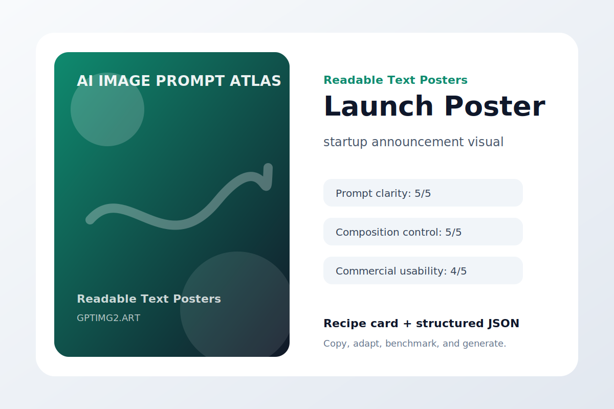 | 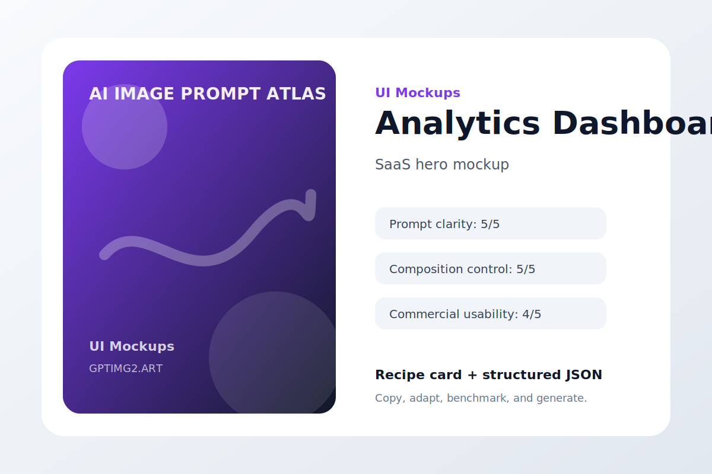 |
| **Minimal Wireless Charger**<br>Product Photography | **Launch Poster**<br>Readable Text Posters | **Analytics Dashboard**<br>UI Mockups |
| 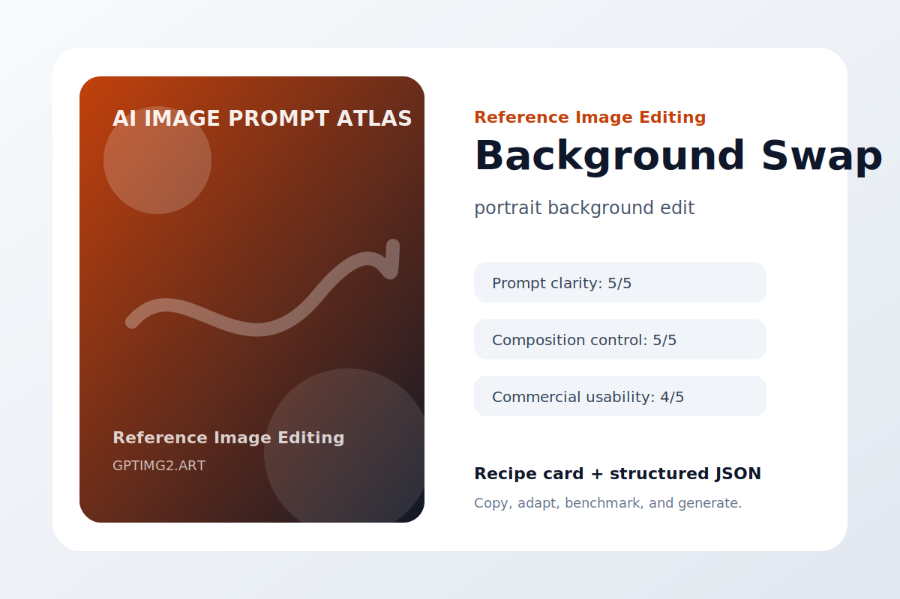 | 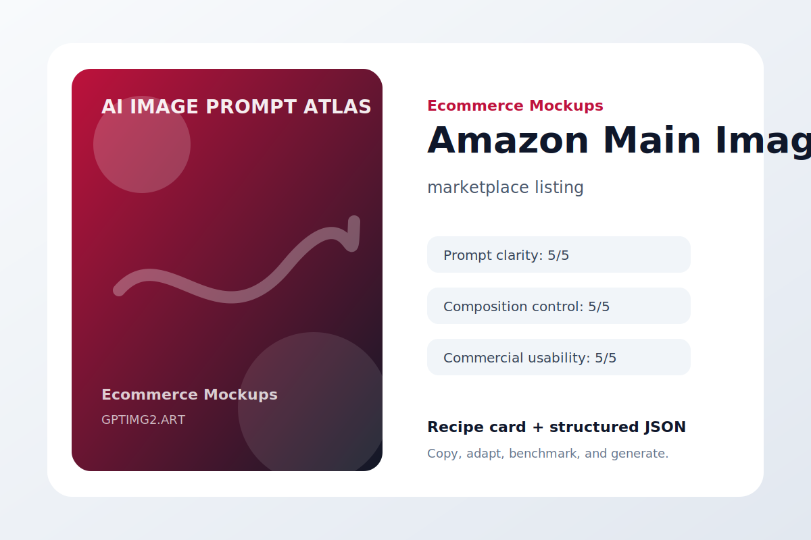 | 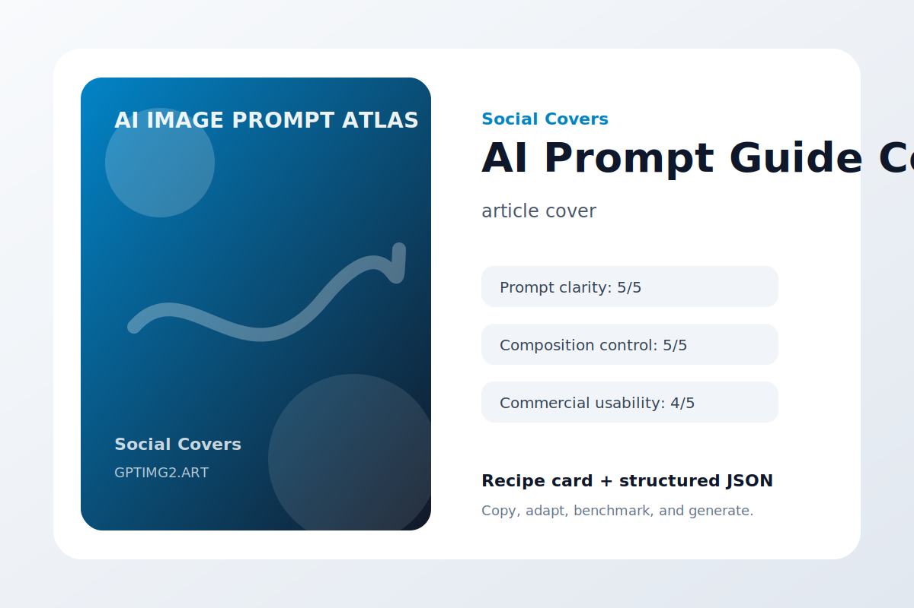 |
| **Background Swap**<br>Reference Image Editing | **Amazon Main Image**<br>Ecommerce Mockups | **AI Prompt Guide Cover**<br>Social Covers |
| 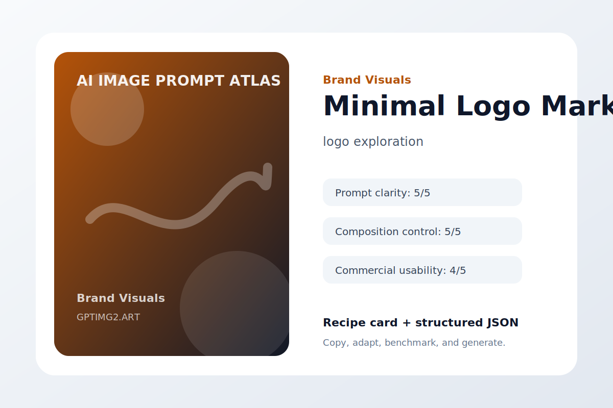 | 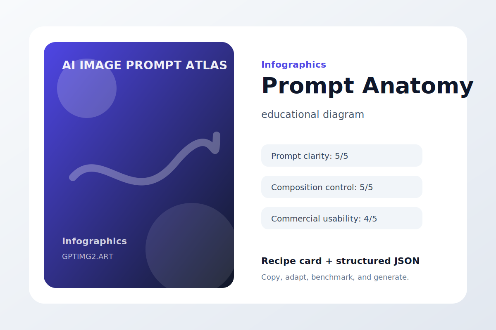 | 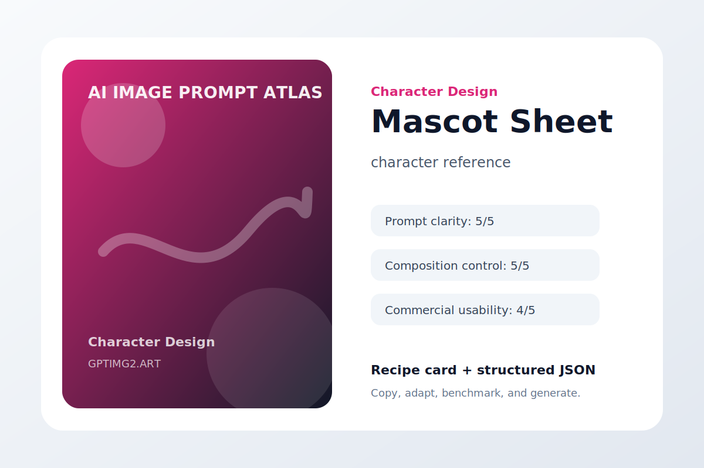 |
| **Minimal Logo Mark**<br>Brand Visuals | **Prompt Anatomy**<br>Infographics | **Mascot Sheet**<br>Character Design |
| 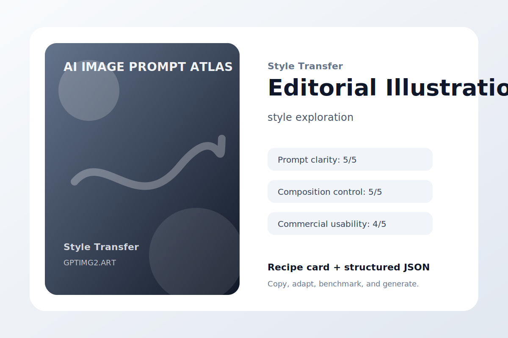 | 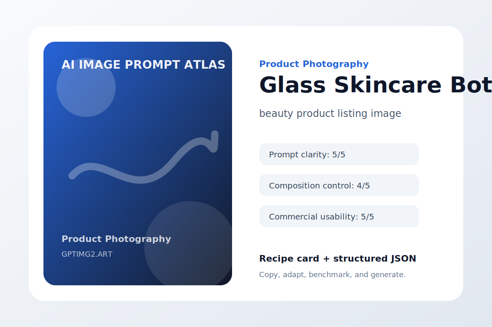 | 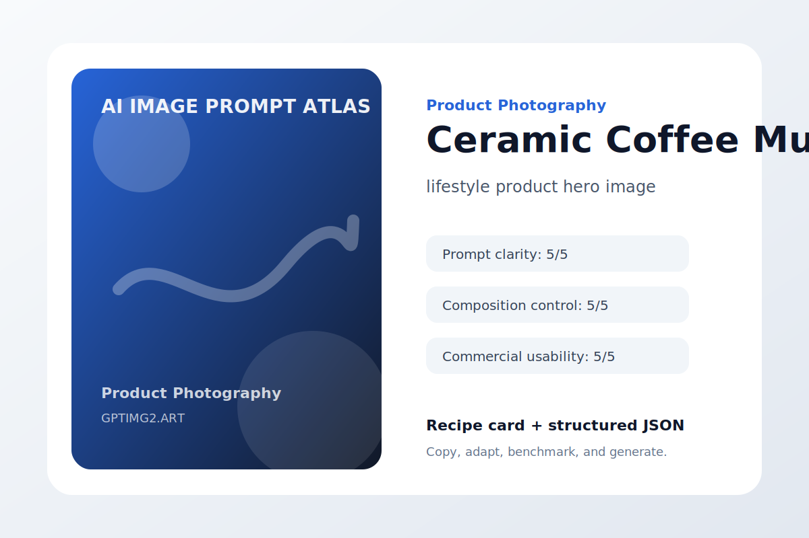 |
| **Editorial Illustration**<br>Style Transfer | **Glass Skincare Bottle**<br>Product Photography | **Ceramic Coffee Mug**<br>Product Photography |


## Categories

- [Product Photography](examples/product-photography.md) - Commercial product images with controlled lighting, materials, and layout.
- [Readable Text Posters](examples/readable-text.md) - Poster and cover prompts that prioritize legible typography and clean layout.
- [UI Mockups](examples/ui-mockups.md) - App and dashboard visuals with readable interface hierarchy.
- [Reference Image Editing](examples/reference-editing.md) - Editing prompts that preserve subject identity while changing context or style.
- [Ecommerce Mockups](examples/ecommerce-mockups.md) - Market-ready product, packaging, and listing visuals.
- [Social Covers](examples/social-covers.md) - Thumbnails, blog covers, carousels, and social posts.
- [Brand Visuals](examples/brand-visuals.md) - Brand marks, campaign art direction, and visual identity exploration.
- [Infographics](examples/infographics.md) - Structured visuals that explain workflows, comparisons, and concepts.
- [Character Design](examples/character-design.md) - Consistent character sheets, poses, outfits, and stylized concepts.
- [Style Transfer](examples/style-transfer.md) - Prompts for controlled visual style changes without losing core structure.

## Dataset

The full dataset is available in [data/prompts.json](data/prompts.json). Each entry includes title, category, use case, prompt, negative prompt, image path, scores, tags, and GPTImg2 links.

Current first edition:

- 80 prompt recipes
- 10 categories
- Machine-readable JSON
- GitHub Pages searchable gallery
- Multilingual README entry points

## Prompt Recipe Format

```md
## Minimal Wireless Charger

Category: Product Photography
Use case: premium ecommerce hero image
Input type: text prompt
Aspect ratio: 1:1 or 16:9

Prompt:
...

Negative instructions:
...

Why it works:
- The use case is declared before the visual style.
- The subject is specific enough to reduce model guessing.
- Composition and lighting constraints make the result easier to revise.

Try this workflow:
https://gptimg2.art/
```

## Benchmarks

Scores are editorial labels for comparing prompt recipe quality, not model performance guarantees.

- Prompt clarity
- Composition control
- Text accuracy
- Object consistency
- Commercial usability

See [data/benchmarks.json](data/benchmarks.json).

## Guides

- [Prompt Writing Guide](guides/prompt-writing-guide.md)
- [Product Photo Prompt Guide](guides/product-photo-guide.md)
- [Reference Image Editing Guide](guides/reference-image-editing-guide.md)

## Multilingual

- [中文](README_zh.md)
- [日本語](README_ja.md)
- [Español](README_es.md)

## Tool Note

You can adapt these prompts to any modern AI image generator. For a simple GPT Image 2 style online workflow, try [GPTImg2](https://gptimg2.art/).

## Quality Bar

This project aims to become a practical prompt operating system, not a collection of random prompt screenshots.

See [QUALITY_BAR.md](QUALITY_BAR.md) and [ROADMAP.md](ROADMAP.md).

## Contributing

Prompt recipes, output examples, corrections, translations, and benchmark suggestions are welcome. See [CONTRIBUTING.md](CONTRIBUTING.md).

## License

Content is released under CC BY 4.0 unless otherwise noted. Code is released under MIT.
