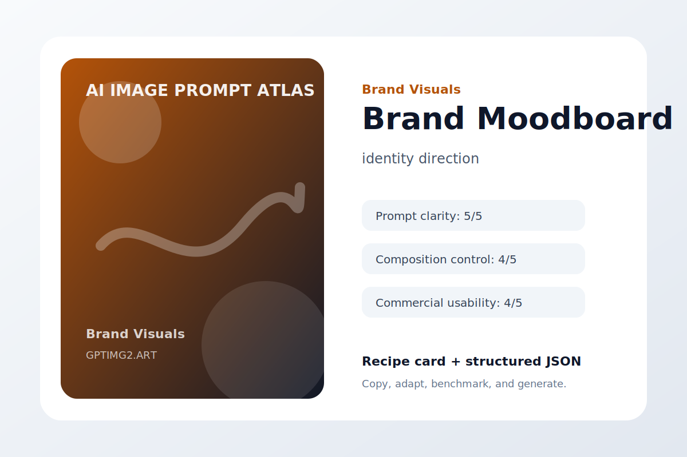
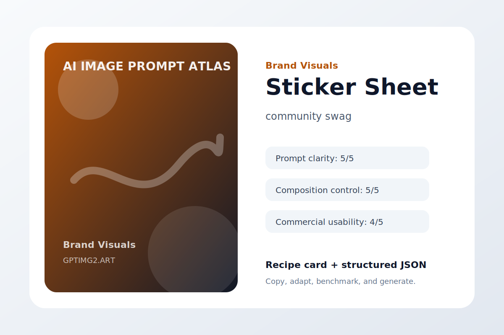
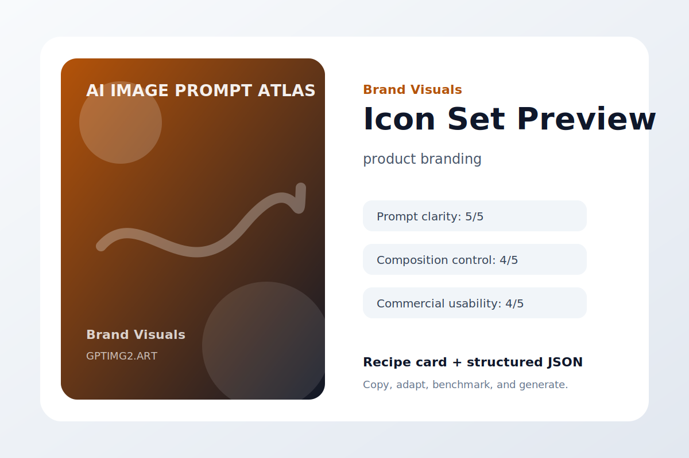
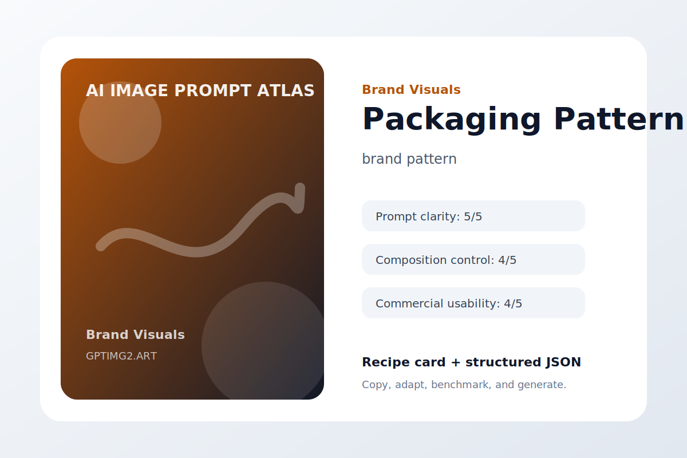
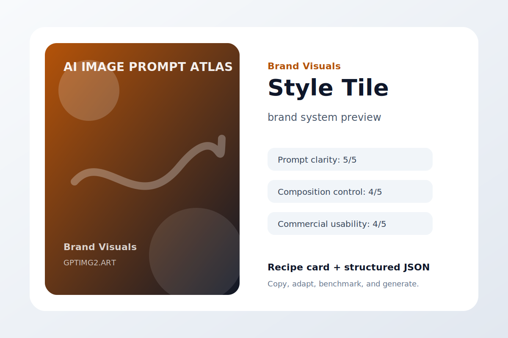

# Brand Visuals

Brand marks, campaign art direction, and visual identity exploration.

## Minimal Logo Mark


**Use case:** logo exploration  
**Input type:** text prompt  
**Aspect ratio:** 1:1 or 16:9  
**Difficulty:** easy

**Prompt**

```text
Create a polished logo exploration.

Subject: a vector-friendly abstract mark for an AI design studio.

Composition: clear focal point, intentional negative space, balanced depth, no clutter.

Lighting: soft professional lighting with realistic shadows and material detail.

Style: high-quality AI image generation result suitable for a public design portfolio.

Details: include accurate shapes, clean edges, coherent color harmony, and a result that still works at thumbnail size.

Constraints: avoid warped geometry, random text, extra logos, duplicated objects, messy reflections, watermark, and low-resolution artifacts.
```

**Negative instructions**

```text
watermark, unreadable text, random logos, warped hands or objects, duplicated subjects, messy background, low-resolution artifacts, unwanted typography
```

**Why it works**

- The use case is declared before the visual style.
- The subject is specific enough to reduce model guessing.
- Composition and lighting constraints make the result easier to revise.
- Failure modes are named directly, which improves practical usability.

**Variations**

- Make a minimal logo exploration version with more whitespace.
- Make a bold social-media-ready version with stronger contrast.
- Make a premium editorial version with refined lighting and texture.

[Try this workflow on GPTImg2](https://gptimg2.art/)


---

## Brand Moodboard



**Use case:** identity direction  
**Input type:** text prompt  
**Aspect ratio:** 1:1 or 16:9  
**Difficulty:** medium

**Prompt**

```text
Create a polished identity direction.

Subject: a moodboard for a calm productivity app brand.

Composition: clear focal point, intentional negative space, balanced depth, no clutter.

Lighting: soft professional lighting with realistic shadows and material detail.

Style: high-quality AI image generation result suitable for a public design portfolio.

Details: include accurate shapes, clean edges, coherent color harmony, and a result that still works at thumbnail size.

Constraints: avoid warped geometry, random text, extra logos, duplicated objects, messy reflections, watermark, and low-resolution artifacts.
```

**Negative instructions**

```text
watermark, unreadable text, random logos, warped hands or objects, duplicated subjects, messy background, low-resolution artifacts, unwanted typography
```

**Why it works**

- The use case is declared before the visual style.
- The subject is specific enough to reduce model guessing.
- Composition and lighting constraints make the result easier to revise.
- Failure modes are named directly, which improves practical usability.

**Variations**

- Make a minimal identity direction version with more whitespace.
- Make a bold social-media-ready version with stronger contrast.
- Make a premium editorial version with refined lighting and texture.

[Try this workflow on GPTImg2](https://gptimg2.art/)


---

## Sticker Sheet



**Use case:** community swag  
**Input type:** text prompt  
**Aspect ratio:** 1:1 or 16:9  
**Difficulty:** advanced

**Prompt**

```text
Create a polished community swag.

Subject: a playful sticker sheet for a creative toolkit brand.

Composition: clear focal point, intentional negative space, balanced depth, no clutter.

Lighting: soft professional lighting with realistic shadows and material detail.

Style: high-quality AI image generation result suitable for a public design portfolio.

Details: include accurate shapes, clean edges, coherent color harmony, and a result that still works at thumbnail size.

Constraints: avoid warped geometry, random text, extra logos, duplicated objects, messy reflections, watermark, and low-resolution artifacts.
```

**Negative instructions**

```text
watermark, unreadable text, random logos, warped hands or objects, duplicated subjects, messy background, low-resolution artifacts, unwanted typography
```

**Why it works**

- The use case is declared before the visual style.
- The subject is specific enough to reduce model guessing.
- Composition and lighting constraints make the result easier to revise.
- Failure modes are named directly, which improves practical usability.

**Variations**

- Make a minimal community swag version with more whitespace.
- Make a bold social-media-ready version with stronger contrast.
- Make a premium editorial version with refined lighting and texture.

[Try this workflow on GPTImg2](https://gptimg2.art/)


---

## Icon Set Preview



**Use case:** product branding  
**Input type:** text prompt  
**Aspect ratio:** 1:1 or 16:9  
**Difficulty:** easy

**Prompt**

```text
Create a polished product branding.

Subject: a consistent set of eight app feature icons.

Composition: clear focal point, intentional negative space, balanced depth, no clutter.

Lighting: soft professional lighting with realistic shadows and material detail.

Style: high-quality AI image generation result suitable for a public design portfolio.

Details: include accurate shapes, clean edges, coherent color harmony, and a result that still works at thumbnail size.

Constraints: avoid warped geometry, random text, extra logos, duplicated objects, messy reflections, watermark, and low-resolution artifacts.
```

**Negative instructions**

```text
watermark, unreadable text, random logos, warped hands or objects, duplicated subjects, messy background, low-resolution artifacts, unwanted typography
```

**Why it works**

- The use case is declared before the visual style.
- The subject is specific enough to reduce model guessing.
- Composition and lighting constraints make the result easier to revise.
- Failure modes are named directly, which improves practical usability.

**Variations**

- Make a minimal product branding version with more whitespace.
- Make a bold social-media-ready version with stronger contrast.
- Make a premium editorial version with refined lighting and texture.

[Try this workflow on GPTImg2](https://gptimg2.art/)


---

## Mascot Concept


**Use case:** brand character  
**Input type:** text prompt  
**Aspect ratio:** 1:1 or 16:9  
**Difficulty:** medium

**Prompt**

```text
Create a polished brand character.

Subject: a friendly abstract assistant mascot for a design tool.

Composition: clear focal point, intentional negative space, balanced depth, no clutter.

Lighting: soft professional lighting with realistic shadows and material detail.

Style: high-quality AI image generation result suitable for a public design portfolio.

Details: include accurate shapes, clean edges, coherent color harmony, and a result that still works at thumbnail size.

Constraints: avoid warped geometry, random text, extra logos, duplicated objects, messy reflections, watermark, and low-resolution artifacts.
```

**Negative instructions**

```text
watermark, unreadable text, random logos, warped hands or objects, duplicated subjects, messy background, low-resolution artifacts, unwanted typography
```

**Why it works**

- The use case is declared before the visual style.
- The subject is specific enough to reduce model guessing.
- Composition and lighting constraints make the result easier to revise.
- Failure modes are named directly, which improves practical usability.

**Variations**

- Make a minimal brand character version with more whitespace.
- Make a bold social-media-ready version with stronger contrast.
- Make a premium editorial version with refined lighting and texture.

[Try this workflow on GPTImg2](https://gptimg2.art/)


---

## Packaging Pattern



**Use case:** brand pattern  
**Input type:** text prompt  
**Aspect ratio:** 1:1 or 16:9  
**Difficulty:** advanced

**Prompt**

```text
Create a polished brand pattern.

Subject: a repeatable pattern for boutique stationery packaging.

Composition: clear focal point, intentional negative space, balanced depth, no clutter.

Lighting: soft professional lighting with realistic shadows and material detail.

Style: high-quality AI image generation result suitable for a public design portfolio.

Details: include accurate shapes, clean edges, coherent color harmony, and a result that still works at thumbnail size.

Constraints: avoid warped geometry, random text, extra logos, duplicated objects, messy reflections, watermark, and low-resolution artifacts.
```

**Negative instructions**

```text
watermark, unreadable text, random logos, warped hands or objects, duplicated subjects, messy background, low-resolution artifacts, unwanted typography
```

**Why it works**

- The use case is declared before the visual style.
- The subject is specific enough to reduce model guessing.
- Composition and lighting constraints make the result easier to revise.
- Failure modes are named directly, which improves practical usability.

**Variations**

- Make a minimal brand pattern version with more whitespace.
- Make a bold social-media-ready version with stronger contrast.
- Make a premium editorial version with refined lighting and texture.

[Try this workflow on GPTImg2](https://gptimg2.art/)


---

## Ad Campaign Key Visual


**Use case:** marketing concept  
**Input type:** text prompt  
**Aspect ratio:** 1:1 or 16:9  
**Difficulty:** easy

**Prompt**

```text
Create a polished marketing concept.

Subject: a key visual for a premium AI image editor campaign.

Composition: clear focal point, intentional negative space, balanced depth, no clutter.

Lighting: soft professional lighting with realistic shadows and material detail.

Style: high-quality AI image generation result suitable for a public design portfolio.

Details: include accurate shapes, clean edges, coherent color harmony, and a result that still works at thumbnail size.

Constraints: avoid warped geometry, random text, extra logos, duplicated objects, messy reflections, watermark, and low-resolution artifacts.
```

**Negative instructions**

```text
watermark, unreadable text, random logos, warped hands or objects, duplicated subjects, messy background, low-resolution artifacts, unwanted typography
```

**Why it works**

- The use case is declared before the visual style.
- The subject is specific enough to reduce model guessing.
- Composition and lighting constraints make the result easier to revise.
- Failure modes are named directly, which improves practical usability.

**Variations**

- Make a minimal marketing concept version with more whitespace.
- Make a bold social-media-ready version with stronger contrast.
- Make a premium editorial version with refined lighting and texture.

[Try this workflow on GPTImg2](https://gptimg2.art/)


---

## Style Tile



**Use case:** brand system preview  
**Input type:** text prompt  
**Aspect ratio:** 1:1 or 16:9  
**Difficulty:** medium

**Prompt**

```text
Create a polished brand system preview.

Subject: a style tile showing colors, type, textures, and buttons.

Composition: clear focal point, intentional negative space, balanced depth, no clutter.

Lighting: soft professional lighting with realistic shadows and material detail.

Style: high-quality AI image generation result suitable for a public design portfolio.

Details: include accurate shapes, clean edges, coherent color harmony, and a result that still works at thumbnail size.

Constraints: avoid warped geometry, random text, extra logos, duplicated objects, messy reflections, watermark, and low-resolution artifacts.
```

**Negative instructions**

```text
watermark, unreadable text, random logos, warped hands or objects, duplicated subjects, messy background, low-resolution artifacts, unwanted typography
```

**Why it works**

- The use case is declared before the visual style.
- The subject is specific enough to reduce model guessing.
- Composition and lighting constraints make the result easier to revise.
- Failure modes are named directly, which improves practical usability.

**Variations**

- Make a minimal brand system preview version with more whitespace.
- Make a bold social-media-ready version with stronger contrast.
- Make a premium editorial version with refined lighting and texture.

[Try this workflow on GPTImg2](https://gptimg2.art/)

