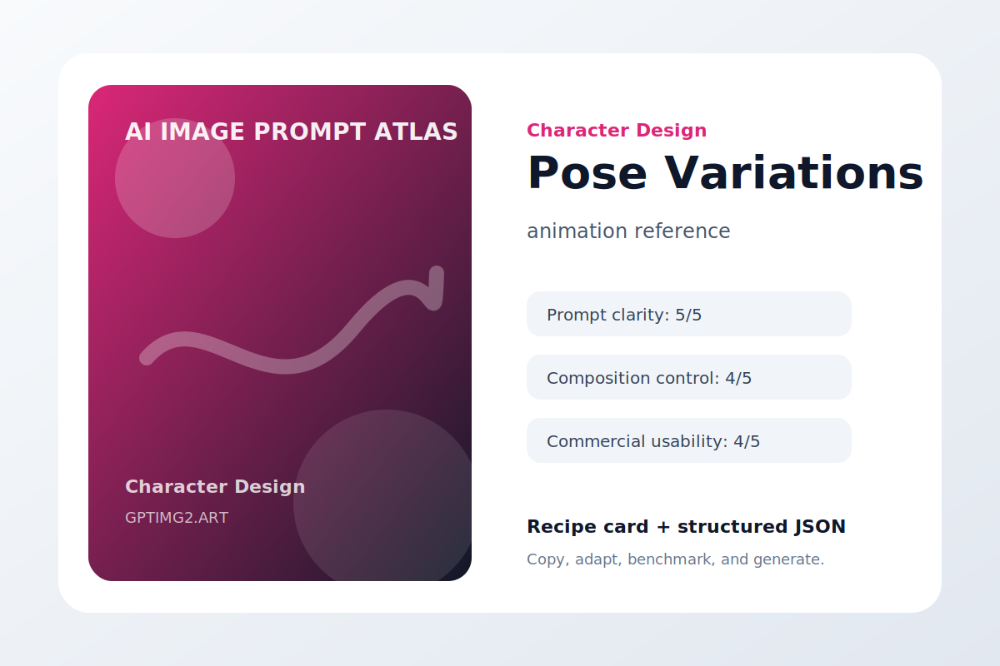
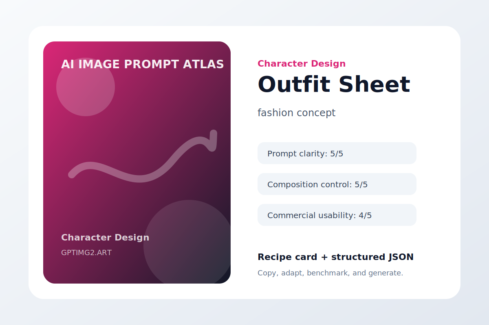
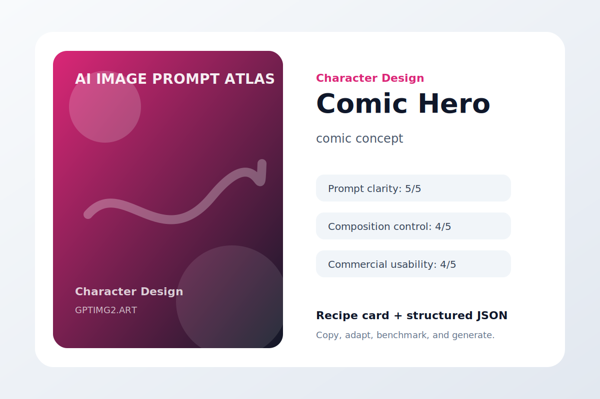
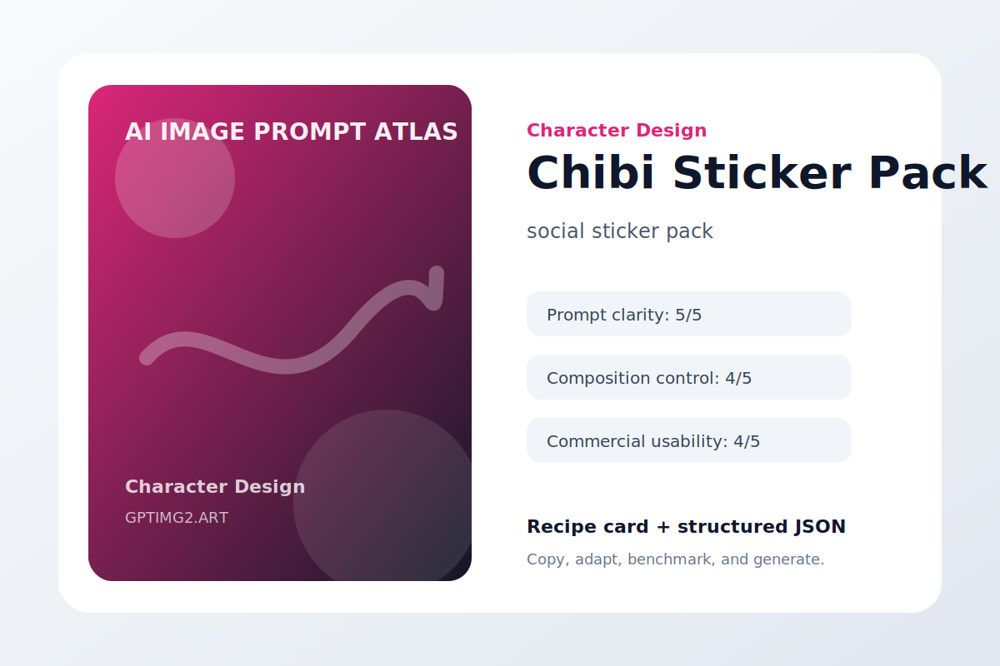

# Character Design

Consistent character sheets, poses, outfits, and stylized concepts.

## Mascot Sheet


**Use case:** character reference  
**Input type:** text prompt  
**Aspect ratio:** 1:1 or 16:9  
**Difficulty:** easy

**Prompt**

```text
Create a polished character reference.

Subject: a full character sheet for a friendly AI studio mascot.

Composition: clear focal point, intentional negative space, balanced depth, no clutter.

Lighting: soft professional lighting with realistic shadows and material detail.

Style: high-quality AI image generation result suitable for a public design portfolio.

Details: include accurate shapes, clean edges, coherent color harmony, and a result that still works at thumbnail size.

Constraints: avoid warped geometry, random text, extra logos, duplicated objects, messy reflections, watermark, and low-resolution artifacts.

Character rule: keep identity, outfit logic, proportions, and style consistent across all views.
```

**Negative instructions**

```text
watermark, unreadable text, random logos, warped hands or objects, duplicated subjects, messy background, low-resolution artifacts, unwanted typography
```

**Why it works**

- The use case is declared before the visual style.
- The subject is specific enough to reduce model guessing.
- Composition and lighting constraints make the result easier to revise.
- Failure modes are named directly, which improves practical usability.

**Variations**

- Make a minimal character reference version with more whitespace.
- Make a bold social-media-ready version with stronger contrast.
- Make a premium editorial version with refined lighting and texture.

[Try this workflow on GPTImg2](https://gptimg2.art/)


---

## Pose Variations



**Use case:** animation reference  
**Input type:** text prompt  
**Aspect ratio:** 1:1 or 16:9  
**Difficulty:** medium

**Prompt**

```text
Create a polished animation reference.

Subject: the same character in six distinct poses.

Composition: clear focal point, intentional negative space, balanced depth, no clutter.

Lighting: soft professional lighting with realistic shadows and material detail.

Style: high-quality AI image generation result suitable for a public design portfolio.

Details: include accurate shapes, clean edges, coherent color harmony, and a result that still works at thumbnail size.

Constraints: avoid warped geometry, random text, extra logos, duplicated objects, messy reflections, watermark, and low-resolution artifacts.

Character rule: keep identity, outfit logic, proportions, and style consistent across all views.
```

**Negative instructions**

```text
watermark, unreadable text, random logos, warped hands or objects, duplicated subjects, messy background, low-resolution artifacts, unwanted typography
```

**Why it works**

- The use case is declared before the visual style.
- The subject is specific enough to reduce model guessing.
- Composition and lighting constraints make the result easier to revise.
- Failure modes are named directly, which improves practical usability.

**Variations**

- Make a minimal animation reference version with more whitespace.
- Make a bold social-media-ready version with stronger contrast.
- Make a premium editorial version with refined lighting and texture.

[Try this workflow on GPTImg2](https://gptimg2.art/)


---

## Outfit Sheet



**Use case:** fashion concept  
**Input type:** text prompt  
**Aspect ratio:** 1:1 or 16:9  
**Difficulty:** advanced

**Prompt**

```text
Create a polished fashion concept.

Subject: a character wearing four seasonal outfits.

Composition: clear focal point, intentional negative space, balanced depth, no clutter.

Lighting: soft professional lighting with realistic shadows and material detail.

Style: high-quality AI image generation result suitable for a public design portfolio.

Details: include accurate shapes, clean edges, coherent color harmony, and a result that still works at thumbnail size.

Constraints: avoid warped geometry, random text, extra logos, duplicated objects, messy reflections, watermark, and low-resolution artifacts.

Character rule: keep identity, outfit logic, proportions, and style consistent across all views.
```

**Negative instructions**

```text
watermark, unreadable text, random logos, warped hands or objects, duplicated subjects, messy background, low-resolution artifacts, unwanted typography
```

**Why it works**

- The use case is declared before the visual style.
- The subject is specific enough to reduce model guessing.
- Composition and lighting constraints make the result easier to revise.
- Failure modes are named directly, which improves practical usability.

**Variations**

- Make a minimal fashion concept version with more whitespace.
- Make a bold social-media-ready version with stronger contrast.
- Make a premium editorial version with refined lighting and texture.

[Try this workflow on GPTImg2](https://gptimg2.art/)


---

## Expression Grid


**Use case:** emotion reference  
**Input type:** text prompt  
**Aspect ratio:** 1:1 or 16:9  
**Difficulty:** easy

**Prompt**

```text
Create a polished emotion reference.

Subject: a grid of twelve facial expressions for one character.

Composition: clear focal point, intentional negative space, balanced depth, no clutter.

Lighting: soft professional lighting with realistic shadows and material detail.

Style: high-quality AI image generation result suitable for a public design portfolio.

Details: include accurate shapes, clean edges, coherent color harmony, and a result that still works at thumbnail size.

Constraints: avoid warped geometry, random text, extra logos, duplicated objects, messy reflections, watermark, and low-resolution artifacts.

Character rule: keep identity, outfit logic, proportions, and style consistent across all views.
```

**Negative instructions**

```text
watermark, unreadable text, random logos, warped hands or objects, duplicated subjects, messy background, low-resolution artifacts, unwanted typography
```

**Why it works**

- The use case is declared before the visual style.
- The subject is specific enough to reduce model guessing.
- Composition and lighting constraints make the result easier to revise.
- Failure modes are named directly, which improves practical usability.

**Variations**

- Make a minimal emotion reference version with more whitespace.
- Make a bold social-media-ready version with stronger contrast.
- Make a premium editorial version with refined lighting and texture.

[Try this workflow on GPTImg2](https://gptimg2.art/)


---

## Game NPC


**Use case:** game concept art  
**Input type:** text prompt  
**Aspect ratio:** 1:1 or 16:9  
**Difficulty:** medium

**Prompt**

```text
Create a polished game concept art.

Subject: a stylized non-player character for a cozy management game.

Composition: clear focal point, intentional negative space, balanced depth, no clutter.

Lighting: soft professional lighting with realistic shadows and material detail.

Style: high-quality AI image generation result suitable for a public design portfolio.

Details: include accurate shapes, clean edges, coherent color harmony, and a result that still works at thumbnail size.

Constraints: avoid warped geometry, random text, extra logos, duplicated objects, messy reflections, watermark, and low-resolution artifacts.

Character rule: keep identity, outfit logic, proportions, and style consistent across all views.
```

**Negative instructions**

```text
watermark, unreadable text, random logos, warped hands or objects, duplicated subjects, messy background, low-resolution artifacts, unwanted typography
```

**Why it works**

- The use case is declared before the visual style.
- The subject is specific enough to reduce model guessing.
- Composition and lighting constraints make the result easier to revise.
- Failure modes are named directly, which improves practical usability.

**Variations**

- Make a minimal game concept art version with more whitespace.
- Make a bold social-media-ready version with stronger contrast.
- Make a premium editorial version with refined lighting and texture.

[Try this workflow on GPTImg2](https://gptimg2.art/)


---

## Comic Hero



**Use case:** comic concept  
**Input type:** text prompt  
**Aspect ratio:** 1:1 or 16:9  
**Difficulty:** advanced

**Prompt**

```text
Create a polished comic concept.

Subject: a clean comic-style hero with cape, boots, and symbol.

Composition: clear focal point, intentional negative space, balanced depth, no clutter.

Lighting: soft professional lighting with realistic shadows and material detail.

Style: high-quality AI image generation result suitable for a public design portfolio.

Details: include accurate shapes, clean edges, coherent color harmony, and a result that still works at thumbnail size.

Constraints: avoid warped geometry, random text, extra logos, duplicated objects, messy reflections, watermark, and low-resolution artifacts.

Character rule: keep identity, outfit logic, proportions, and style consistent across all views.
```

**Negative instructions**

```text
watermark, unreadable text, random logos, warped hands or objects, duplicated subjects, messy background, low-resolution artifacts, unwanted typography
```

**Why it works**

- The use case is declared before the visual style.
- The subject is specific enough to reduce model guessing.
- Composition and lighting constraints make the result easier to revise.
- Failure modes are named directly, which improves practical usability.

**Variations**

- Make a minimal comic concept version with more whitespace.
- Make a bold social-media-ready version with stronger contrast.
- Make a premium editorial version with refined lighting and texture.

[Try this workflow on GPTImg2](https://gptimg2.art/)


---

## 3D Toy Render


**Use case:** toy concept  
**Input type:** text prompt  
**Aspect ratio:** 1:1 or 16:9  
**Difficulty:** easy

**Prompt**

```text
Create a polished toy concept.

Subject: a collectible vinyl toy version of an original character.

Composition: clear focal point, intentional negative space, balanced depth, no clutter.

Lighting: soft professional lighting with realistic shadows and material detail.

Style: high-quality AI image generation result suitable for a public design portfolio.

Details: include accurate shapes, clean edges, coherent color harmony, and a result that still works at thumbnail size.

Constraints: avoid warped geometry, random text, extra logos, duplicated objects, messy reflections, watermark, and low-resolution artifacts.

Character rule: keep identity, outfit logic, proportions, and style consistent across all views.
```

**Negative instructions**

```text
watermark, unreadable text, random logos, warped hands or objects, duplicated subjects, messy background, low-resolution artifacts, unwanted typography
```

**Why it works**

- The use case is declared before the visual style.
- The subject is specific enough to reduce model guessing.
- Composition and lighting constraints make the result easier to revise.
- Failure modes are named directly, which improves practical usability.

**Variations**

- Make a minimal toy concept version with more whitespace.
- Make a bold social-media-ready version with stronger contrast.
- Make a premium editorial version with refined lighting and texture.

[Try this workflow on GPTImg2](https://gptimg2.art/)


---

## Chibi Sticker Pack



**Use case:** social sticker pack  
**Input type:** text prompt  
**Aspect ratio:** 1:1 or 16:9  
**Difficulty:** medium

**Prompt**

```text
Create a polished social sticker pack.

Subject: a set of chibi reaction stickers for one character.

Composition: clear focal point, intentional negative space, balanced depth, no clutter.

Lighting: soft professional lighting with realistic shadows and material detail.

Style: high-quality AI image generation result suitable for a public design portfolio.

Details: include accurate shapes, clean edges, coherent color harmony, and a result that still works at thumbnail size.

Constraints: avoid warped geometry, random text, extra logos, duplicated objects, messy reflections, watermark, and low-resolution artifacts.

Character rule: keep identity, outfit logic, proportions, and style consistent across all views.
```

**Negative instructions**

```text
watermark, unreadable text, random logos, warped hands or objects, duplicated subjects, messy background, low-resolution artifacts, unwanted typography
```

**Why it works**

- The use case is declared before the visual style.
- The subject is specific enough to reduce model guessing.
- Composition and lighting constraints make the result easier to revise.
- Failure modes are named directly, which improves practical usability.

**Variations**

- Make a minimal social sticker pack version with more whitespace.
- Make a bold social-media-ready version with stronger contrast.
- Make a premium editorial version with refined lighting and texture.

[Try this workflow on GPTImg2](https://gptimg2.art/)

