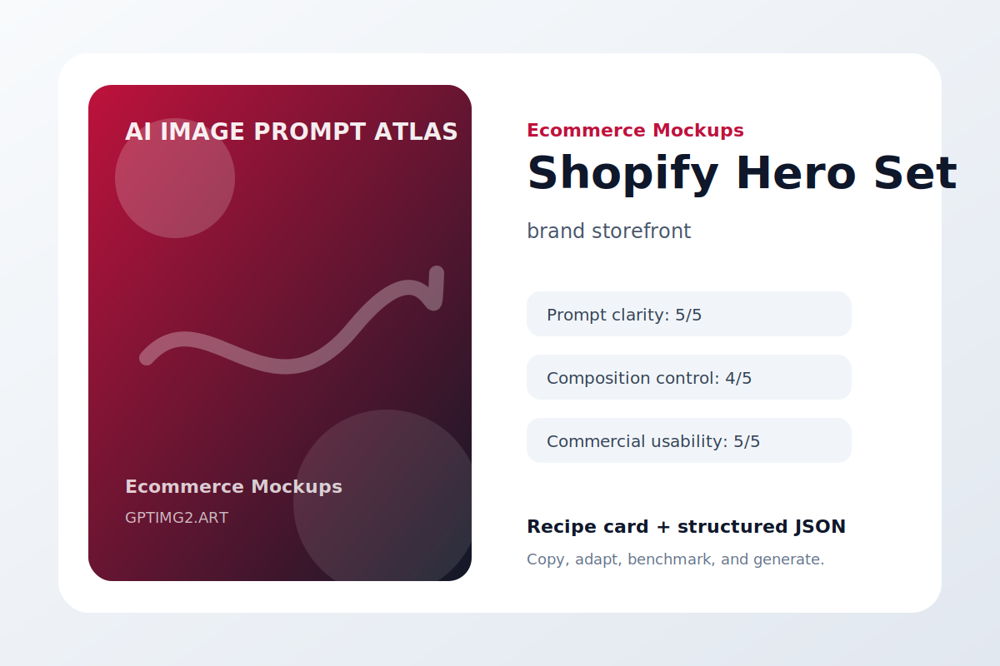
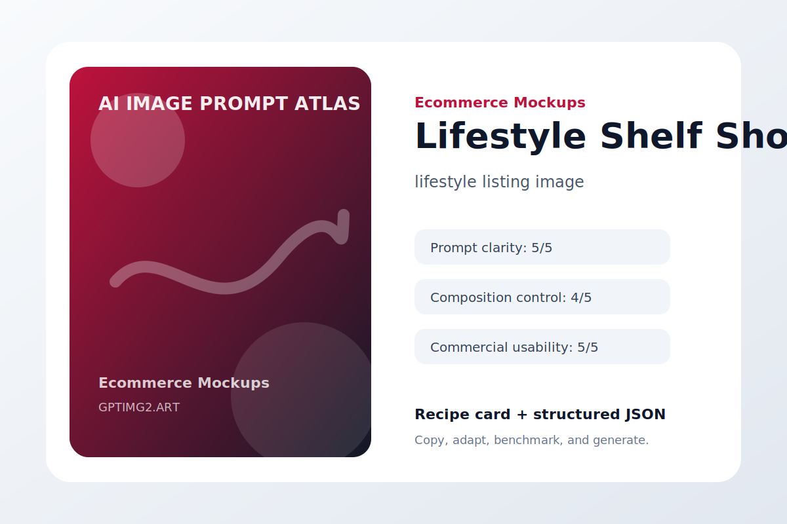

# Ecommerce Mockups

Market-ready product, packaging, and listing visuals.

## Amazon Main Image


**Use case:** marketplace listing  
**Input type:** text prompt  
**Aspect ratio:** 1:1 or 16:9  
**Difficulty:** easy

**Prompt**

```text
Create a marketplace listing with the kind of clarity a shopper needs before clicking.

The commercial asset features a white-background product image for a compact desk organizer. Make the product easy to inspect, keep the background quiet, and use annotations only when they help the buying decision.

Art direction: polished, practical, visually specific, and suitable for a public prompt library.

Avoid: warped geometry, random logos, accidental text, duplicated objects, messy backgrounds, watermark, and low-resolution artifacts.
```

**Negative instructions**

```text
watermark, unreadable text, random logos, warped hands or objects, duplicated subjects, messy background, low-resolution artifacts, unwanted typography
```

**Why it works**

- It starts with the outcome the image needs to serve, so the model is not guessing the format.
- The subject is concrete enough to anchor the scene before style words enter the prompt.
- The art direction describes what success should feel like, not just what should appear.
- The avoid list removes the common visual failures that usually make AI images hard to use.

**Variations**

- Make a minimal marketplace listing version with more whitespace.
- Make a bold social-media-ready version with stronger contrast.
- Make a premium editorial version with refined lighting and texture.

[Try this workflow on GPTImg2](https://gptimg2.art/)


---

## Shopify Hero Set



**Use case:** brand storefront  
**Input type:** text prompt  
**Aspect ratio:** 1:1 or 16:9  
**Difficulty:** medium

**Prompt**

```text
Create a brand storefront with the kind of clarity a shopper needs before clicking.

The commercial asset features three product images for a skincare bundle on a soft pastel background. Make the product easy to inspect, keep the background quiet, and use annotations only when they help the buying decision.

Art direction: polished, practical, visually specific, and suitable for a public prompt library.

Avoid: warped geometry, random logos, accidental text, duplicated objects, messy backgrounds, watermark, and low-resolution artifacts.
```

**Negative instructions**

```text
watermark, unreadable text, random logos, warped hands or objects, duplicated subjects, messy background, low-resolution artifacts, unwanted typography
```

**Why it works**

- It starts with the outcome the image needs to serve, so the model is not guessing the format.
- The subject is concrete enough to anchor the scene before style words enter the prompt.
- The art direction describes what success should feel like, not just what should appear.
- The avoid list removes the common visual failures that usually make AI images hard to use.

**Variations**

- Make a minimal brand storefront version with more whitespace.
- Make a bold social-media-ready version with stronger contrast.
- Make a premium editorial version with refined lighting and texture.

[Try this workflow on GPTImg2](https://gptimg2.art/)


---

## Packaging Box


**Use case:** packaging concept  
**Input type:** text prompt  
**Aspect ratio:** 1:1 or 16:9  
**Difficulty:** advanced

**Prompt**

```text
Create a packaging concept with the kind of clarity a shopper needs before clicking.

The commercial asset features a recyclable kraft paper packaging box for organic tea. Make the product easy to inspect, keep the background quiet, and use annotations only when they help the buying decision.

Art direction: polished, practical, visually specific, and suitable for a public prompt library.

Avoid: warped geometry, random logos, accidental text, duplicated objects, messy backgrounds, watermark, and low-resolution artifacts.
```

**Negative instructions**

```text
watermark, unreadable text, random logos, warped hands or objects, duplicated subjects, messy background, low-resolution artifacts, unwanted typography
```

**Why it works**

- It starts with the outcome the image needs to serve, so the model is not guessing the format.
- The subject is concrete enough to anchor the scene before style words enter the prompt.
- The art direction describes what success should feel like, not just what should appear.
- The avoid list removes the common visual failures that usually make AI images hard to use.

**Variations**

- Make a minimal packaging concept version with more whitespace.
- Make a bold social-media-ready version with stronger contrast.
- Make a premium editorial version with refined lighting and texture.

[Try this workflow on GPTImg2](https://gptimg2.art/)


---

## Before After Split


**Use case:** conversion ad  
**Input type:** text prompt  
**Aspect ratio:** 1:1 or 16:9  
**Difficulty:** easy

**Prompt**

```text
Create a conversion ad with the kind of clarity a shopper needs before clicking.

The commercial asset features a split comparison image for a cleaning product. Make the product easy to inspect, keep the background quiet, and use annotations only when they help the buying decision.

Art direction: polished, practical, visually specific, and suitable for a public prompt library.

Avoid: warped geometry, random logos, accidental text, duplicated objects, messy backgrounds, watermark, and low-resolution artifacts.
```

**Negative instructions**

```text
watermark, unreadable text, random logos, warped hands or objects, duplicated subjects, messy background, low-resolution artifacts, unwanted typography
```

**Why it works**

- It starts with the outcome the image needs to serve, so the model is not guessing the format.
- The subject is concrete enough to anchor the scene before style words enter the prompt.
- The art direction describes what success should feel like, not just what should appear.
- The avoid list removes the common visual failures that usually make AI images hard to use.

**Variations**

- Make a minimal conversion ad version with more whitespace.
- Make a bold social-media-ready version with stronger contrast.
- Make a premium editorial version with refined lighting and texture.

[Try this workflow on GPTImg2](https://gptimg2.art/)


---

## Bundle Layout


**Use case:** bundle listing  
**Input type:** text prompt  
**Aspect ratio:** 1:1 or 16:9  
**Difficulty:** medium

**Prompt**

```text
Create a bundle listing with the kind of clarity a shopper needs before clicking.

The commercial asset features a neatly arranged bundle of notebook, pen, and desk accessories. Make the product easy to inspect, keep the background quiet, and use annotations only when they help the buying decision.

Art direction: polished, practical, visually specific, and suitable for a public prompt library.

Avoid: warped geometry, random logos, accidental text, duplicated objects, messy backgrounds, watermark, and low-resolution artifacts.
```

**Negative instructions**

```text
watermark, unreadable text, random logos, warped hands or objects, duplicated subjects, messy background, low-resolution artifacts, unwanted typography
```

**Why it works**

- It starts with the outcome the image needs to serve, so the model is not guessing the format.
- The subject is concrete enough to anchor the scene before style words enter the prompt.
- The art direction describes what success should feel like, not just what should appear.
- The avoid list removes the common visual failures that usually make AI images hard to use.

**Variations**

- Make a minimal bundle listing version with more whitespace.
- Make a bold social-media-ready version with stronger contrast.
- Make a premium editorial version with refined lighting and texture.

[Try this workflow on GPTImg2](https://gptimg2.art/)


---

## Lifestyle Shelf Shot



**Use case:** lifestyle listing image  
**Input type:** text prompt  
**Aspect ratio:** 1:1 or 16:9  
**Difficulty:** advanced

**Prompt**

```text
Create a lifestyle listing image with the kind of clarity a shopper needs before clicking.

The commercial asset features a home shelf scene featuring a minimalist candle jar. Make the product easy to inspect, keep the background quiet, and use annotations only when they help the buying decision.

Art direction: polished, practical, visually specific, and suitable for a public prompt library.

Avoid: warped geometry, random logos, accidental text, duplicated objects, messy backgrounds, watermark, and low-resolution artifacts.
```

**Negative instructions**

```text
watermark, unreadable text, random logos, warped hands or objects, duplicated subjects, messy background, low-resolution artifacts, unwanted typography
```

**Why it works**

- It starts with the outcome the image needs to serve, so the model is not guessing the format.
- The subject is concrete enough to anchor the scene before style words enter the prompt.
- The art direction describes what success should feel like, not just what should appear.
- The avoid list removes the common visual failures that usually make AI images hard to use.

**Variations**

- Make a minimal lifestyle listing image version with more whitespace.
- Make a bold social-media-ready version with stronger contrast.
- Make a premium editorial version with refined lighting and texture.

[Try this workflow on GPTImg2](https://gptimg2.art/)


---

## Size Comparison


**Use case:** listing infographic  
**Input type:** text prompt  
**Aspect ratio:** 1:1 or 16:9  
**Difficulty:** easy

**Prompt**

```text
Create a listing infographic with the kind of clarity a shopper needs before clicking.

The commercial asset features a product scale comparison next to a phone and hand silhouette. Make the product easy to inspect, keep the background quiet, and use annotations only when they help the buying decision.

Art direction: polished, practical, visually specific, and suitable for a public prompt library.

Avoid: warped geometry, random logos, accidental text, duplicated objects, messy backgrounds, watermark, and low-resolution artifacts.
```

**Negative instructions**

```text
watermark, unreadable text, random logos, warped hands or objects, duplicated subjects, messy background, low-resolution artifacts, unwanted typography
```

**Why it works**

- It starts with the outcome the image needs to serve, so the model is not guessing the format.
- The subject is concrete enough to anchor the scene before style words enter the prompt.
- The art direction describes what success should feel like, not just what should appear.
- The avoid list removes the common visual failures that usually make AI images hard to use.

**Variations**

- Make a minimal listing infographic version with more whitespace.
- Make a bold social-media-ready version with stronger contrast.
- Make a premium editorial version with refined lighting and texture.

[Try this workflow on GPTImg2](https://gptimg2.art/)


---

## Feature Callouts


**Use case:** feature visual  
**Input type:** text prompt  
**Aspect ratio:** 1:1 or 16:9  
**Difficulty:** medium

**Prompt**

```text
Create a feature visual with the kind of clarity a shopper needs before clicking.

The commercial asset features a product image with three clean annotation callouts. Make the product easy to inspect, keep the background quiet, and use annotations only when they help the buying decision.

Art direction: polished, practical, visually specific, and suitable for a public prompt library.

Avoid: warped geometry, random logos, accidental text, duplicated objects, messy backgrounds, watermark, and low-resolution artifacts.
```

**Negative instructions**

```text
watermark, unreadable text, random logos, warped hands or objects, duplicated subjects, messy background, low-resolution artifacts, unwanted typography
```

**Why it works**

- It starts with the outcome the image needs to serve, so the model is not guessing the format.
- The subject is concrete enough to anchor the scene before style words enter the prompt.
- The art direction describes what success should feel like, not just what should appear.
- The avoid list removes the common visual failures that usually make AI images hard to use.

**Variations**

- Make a minimal feature visual version with more whitespace.
- Make a bold social-media-ready version with stronger contrast.
- Make a premium editorial version with refined lighting and texture.

[Try this workflow on GPTImg2](https://gptimg2.art/)

