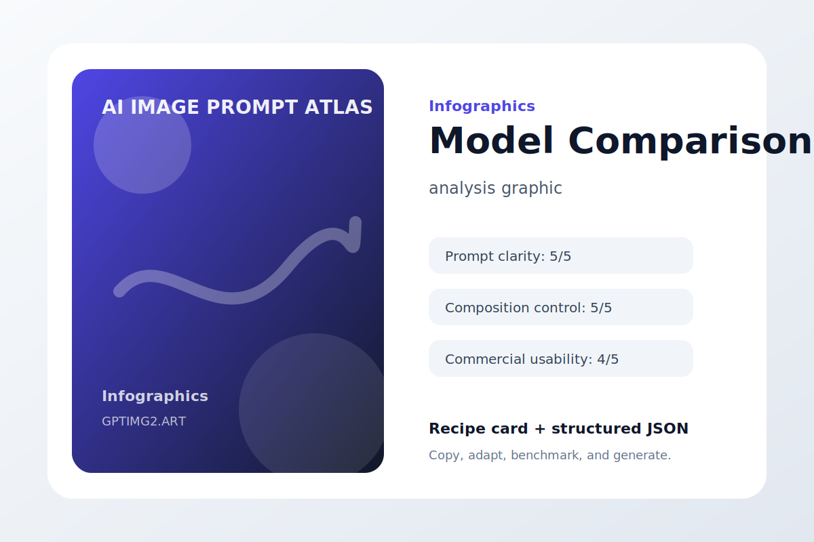
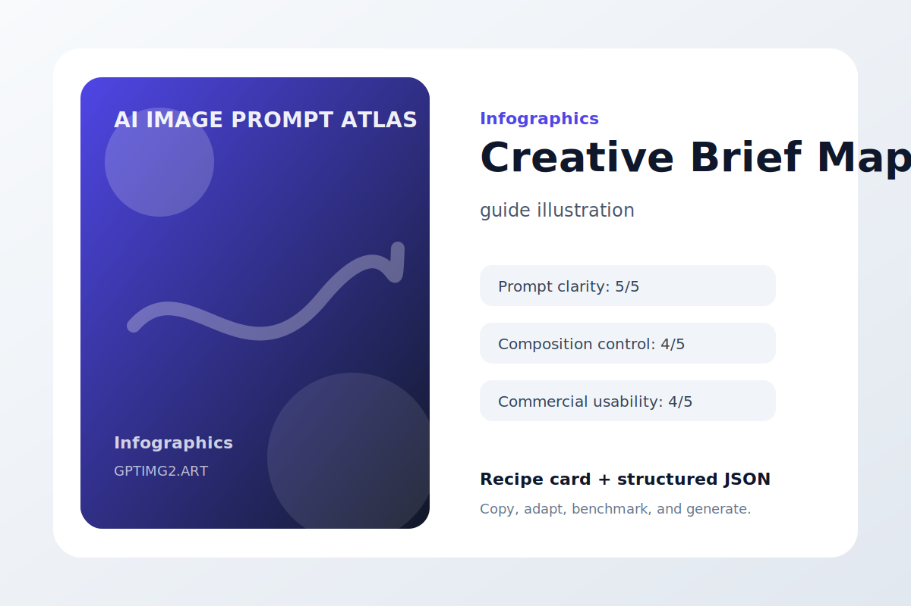
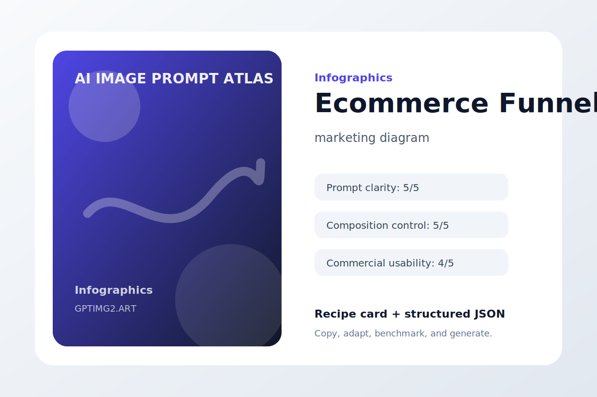

# Infographics

Structured visuals that explain workflows, comparisons, and concepts.

## Prompt Anatomy


**Use case:** educational diagram  
**Input type:** text prompt  
**Aspect ratio:** 1:1 or 16:9  
**Difficulty:** easy

**Prompt**

```text
Create an educational diagram that explains the idea at a glance before asking the viewer to read details.

The explainer subject is an infographic explaining subject, composition, style, details, and constraints. Use clear sections, short labels, strong hierarchy, and visual grouping so the viewer understands the flow quickly.

Art direction: polished, practical, visually specific, and suitable for a public prompt library.

Avoid: warped geometry, random logos, accidental text, duplicated objects, messy backgrounds, watermark, and low-resolution artifacts.
```

**Negative instructions**

```text
watermark, unreadable text, random logos, warped hands or objects, duplicated subjects, messy background, low-resolution artifacts, unwanted typography
```

**Why it works**

- It starts with the outcome the image needs to serve, so the model is not guessing the format.
- The subject is concrete enough to anchor the scene before style words enter the prompt.
- The art direction describes what success should feel like, not just what should appear.
- The avoid list removes the common visual failures that usually make AI images hard to use.

**Variations**

- Make a minimal educational diagram version with more whitespace.
- Make a bold social-media-ready version with stronger contrast.
- Make a premium editorial version with refined lighting and texture.

[Try this workflow on GPTImg2](https://gptimg2.art/)


---

## Workflow Ladder


**Use case:** process infographic  
**Input type:** text prompt  
**Aspect ratio:** 1:1 or 16:9  
**Difficulty:** medium

**Prompt**

```text
Create a process infographic that explains the idea at a glance before asking the viewer to read details.

The explainer subject is a step-by-step visual workflow from brief to final image. Use clear sections, short labels, strong hierarchy, and visual grouping so the viewer understands the flow quickly.

Art direction: polished, practical, visually specific, and suitable for a public prompt library.

Avoid: warped geometry, random logos, accidental text, duplicated objects, messy backgrounds, watermark, and low-resolution artifacts.
```

**Negative instructions**

```text
watermark, unreadable text, random logos, warped hands or objects, duplicated subjects, messy background, low-resolution artifacts, unwanted typography
```

**Why it works**

- It starts with the outcome the image needs to serve, so the model is not guessing the format.
- The subject is concrete enough to anchor the scene before style words enter the prompt.
- The art direction describes what success should feel like, not just what should appear.
- The avoid list removes the common visual failures that usually make AI images hard to use.

**Variations**

- Make a minimal process infographic version with more whitespace.
- Make a bold social-media-ready version with stronger contrast.
- Make a premium editorial version with refined lighting and texture.

[Try this workflow on GPTImg2](https://gptimg2.art/)


---

## Model Comparison



**Use case:** analysis graphic  
**Input type:** text prompt  
**Aspect ratio:** 1:1 or 16:9  
**Difficulty:** advanced

**Prompt**

```text
Create an analysis graphic that explains the idea at a glance before asking the viewer to read details.

The explainer subject is a comparison chart for image generation use cases. Use clear sections, short labels, strong hierarchy, and visual grouping so the viewer understands the flow quickly.

Art direction: polished, practical, visually specific, and suitable for a public prompt library.

Avoid: warped geometry, random logos, accidental text, duplicated objects, messy backgrounds, watermark, and low-resolution artifacts.
```

**Negative instructions**

```text
watermark, unreadable text, random logos, warped hands or objects, duplicated subjects, messy background, low-resolution artifacts, unwanted typography
```

**Why it works**

- It starts with the outcome the image needs to serve, so the model is not guessing the format.
- The subject is concrete enough to anchor the scene before style words enter the prompt.
- The art direction describes what success should feel like, not just what should appear.
- The avoid list removes the common visual failures that usually make AI images hard to use.

**Variations**

- Make a minimal analysis graphic version with more whitespace.
- Make a bold social-media-ready version with stronger contrast.
- Make a premium editorial version with refined lighting and texture.

[Try this workflow on GPTImg2](https://gptimg2.art/)


---

## Creative Brief Map



**Use case:** guide illustration  
**Input type:** text prompt  
**Aspect ratio:** 1:1 or 16:9  
**Difficulty:** easy

**Prompt**

```text
Create a guide illustration that explains the idea at a glance before asking the viewer to read details.

The explainer subject is a mind map for turning vague ideas into image prompts. Use clear sections, short labels, strong hierarchy, and visual grouping so the viewer understands the flow quickly.

Art direction: polished, practical, visually specific, and suitable for a public prompt library.

Avoid: warped geometry, random logos, accidental text, duplicated objects, messy backgrounds, watermark, and low-resolution artifacts.
```

**Negative instructions**

```text
watermark, unreadable text, random logos, warped hands or objects, duplicated subjects, messy background, low-resolution artifacts, unwanted typography
```

**Why it works**

- It starts with the outcome the image needs to serve, so the model is not guessing the format.
- The subject is concrete enough to anchor the scene before style words enter the prompt.
- The art direction describes what success should feel like, not just what should appear.
- The avoid list removes the common visual failures that usually make AI images hard to use.

**Variations**

- Make a minimal guide illustration version with more whitespace.
- Make a bold social-media-ready version with stronger contrast.
- Make a premium editorial version with refined lighting and texture.

[Try this workflow on GPTImg2](https://gptimg2.art/)


---

## Ecommerce Funnel



**Use case:** marketing diagram  
**Input type:** text prompt  
**Aspect ratio:** 1:1 or 16:9  
**Difficulty:** medium

**Prompt**

```text
Create a marketing diagram that explains the idea at a glance before asking the viewer to read details.

The explainer subject is an infographic showing product image types across a sales funnel. Use clear sections, short labels, strong hierarchy, and visual grouping so the viewer understands the flow quickly.

Art direction: polished, practical, visually specific, and suitable for a public prompt library.

Avoid: warped geometry, random logos, accidental text, duplicated objects, messy backgrounds, watermark, and low-resolution artifacts.
```

**Negative instructions**

```text
watermark, unreadable text, random logos, warped hands or objects, duplicated subjects, messy background, low-resolution artifacts, unwanted typography
```

**Why it works**

- It starts with the outcome the image needs to serve, so the model is not guessing the format.
- The subject is concrete enough to anchor the scene before style words enter the prompt.
- The art direction describes what success should feel like, not just what should appear.
- The avoid list removes the common visual failures that usually make AI images hard to use.

**Variations**

- Make a minimal marketing diagram version with more whitespace.
- Make a bold social-media-ready version with stronger contrast.
- Make a premium editorial version with refined lighting and texture.

[Try this workflow on GPTImg2](https://gptimg2.art/)


---

## Editing Checklist


**Use case:** QA guide  
**Input type:** text prompt  
**Aspect ratio:** 1:1 or 16:9  
**Difficulty:** advanced

**Prompt**

```text
Create a QA guide that explains the idea at a glance before asking the viewer to read details.

The explainer subject is a checklist visual for reference image editing quality control. Use clear sections, short labels, strong hierarchy, and visual grouping so the viewer understands the flow quickly.

Art direction: polished, practical, visually specific, and suitable for a public prompt library.

Avoid: warped geometry, random logos, accidental text, duplicated objects, messy backgrounds, watermark, and low-resolution artifacts.
```

**Negative instructions**

```text
watermark, unreadable text, random logos, warped hands or objects, duplicated subjects, messy background, low-resolution artifacts, unwanted typography
```

**Why it works**

- It starts with the outcome the image needs to serve, so the model is not guessing the format.
- The subject is concrete enough to anchor the scene before style words enter the prompt.
- The art direction describes what success should feel like, not just what should appear.
- The avoid list removes the common visual failures that usually make AI images hard to use.

**Variations**

- Make a minimal QA guide version with more whitespace.
- Make a bold social-media-ready version with stronger contrast.
- Make a premium editorial version with refined lighting and texture.

[Try this workflow on GPTImg2](https://gptimg2.art/)


---

## Prompt Matrix


**Use case:** prompt education  
**Input type:** text prompt  
**Aspect ratio:** 1:1 or 16:9  
**Difficulty:** easy

**Prompt**

```text
Create a prompt education that explains the idea at a glance before asking the viewer to read details.

The explainer subject is a matrix comparing style, lighting, camera, and constraints. Use clear sections, short labels, strong hierarchy, and visual grouping so the viewer understands the flow quickly.

Art direction: polished, practical, visually specific, and suitable for a public prompt library.

Avoid: warped geometry, random logos, accidental text, duplicated objects, messy backgrounds, watermark, and low-resolution artifacts.
```

**Negative instructions**

```text
watermark, unreadable text, random logos, warped hands or objects, duplicated subjects, messy background, low-resolution artifacts, unwanted typography
```

**Why it works**

- It starts with the outcome the image needs to serve, so the model is not guessing the format.
- The subject is concrete enough to anchor the scene before style words enter the prompt.
- The art direction describes what success should feel like, not just what should appear.
- The avoid list removes the common visual failures that usually make AI images hard to use.

**Variations**

- Make a minimal prompt education version with more whitespace.
- Make a bold social-media-ready version with stronger contrast.
- Make a premium editorial version with refined lighting and texture.

[Try this workflow on GPTImg2](https://gptimg2.art/)


---

## Failure Modes


**Use case:** training graphic  
**Input type:** text prompt  
**Aspect ratio:** 1:1 or 16:9  
**Difficulty:** medium

**Prompt**

```text
Create a training graphic that explains the idea at a glance before asking the viewer to read details.

The explainer subject is a visual chart of common AI image generation mistakes. Use clear sections, short labels, strong hierarchy, and visual grouping so the viewer understands the flow quickly.

Art direction: polished, practical, visually specific, and suitable for a public prompt library.

Avoid: warped geometry, random logos, accidental text, duplicated objects, messy backgrounds, watermark, and low-resolution artifacts.
```

**Negative instructions**

```text
watermark, unreadable text, random logos, warped hands or objects, duplicated subjects, messy background, low-resolution artifacts, unwanted typography
```

**Why it works**

- It starts with the outcome the image needs to serve, so the model is not guessing the format.
- The subject is concrete enough to anchor the scene before style words enter the prompt.
- The art direction describes what success should feel like, not just what should appear.
- The avoid list removes the common visual failures that usually make AI images hard to use.

**Variations**

- Make a minimal training graphic version with more whitespace.
- Make a bold social-media-ready version with stronger contrast.
- Make a premium editorial version with refined lighting and texture.

[Try this workflow on GPTImg2](https://gptimg2.art/)

