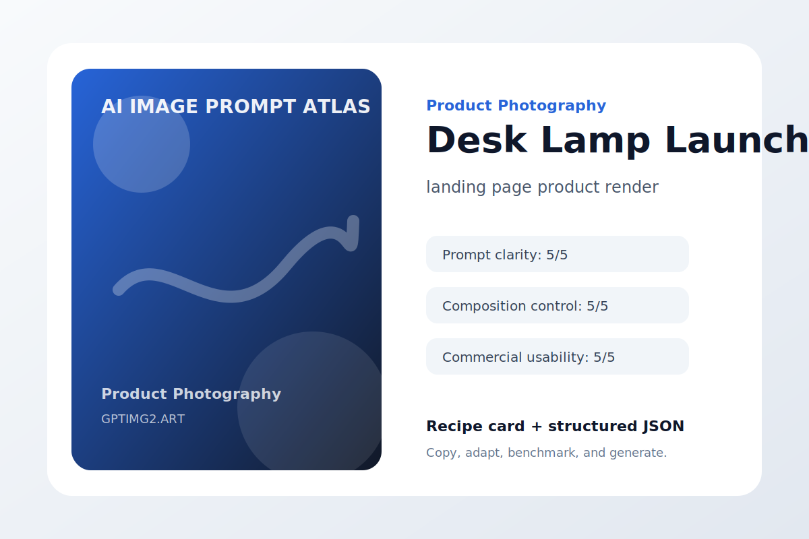
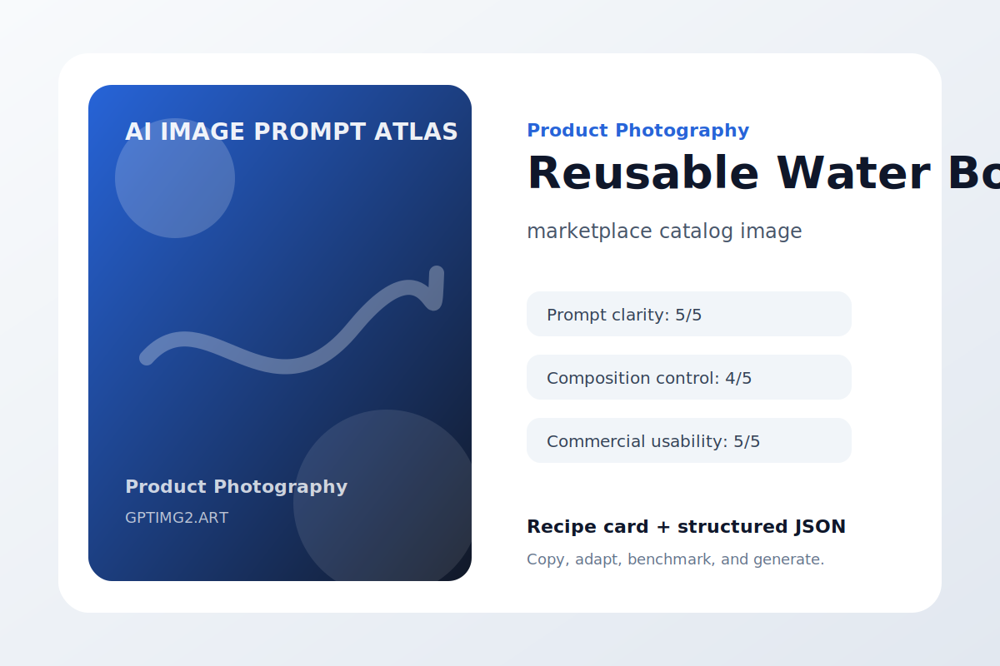

# Product Photography

Commercial product images with controlled lighting, materials, and layout.

## Minimal Wireless Charger


**Use case:** premium ecommerce hero image  
**Input type:** text prompt  
**Aspect ratio:** 1:1 or 16:9  
**Difficulty:** easy

**Prompt**

```text
Create a polished premium ecommerce hero image.

Subject: a matte black wireless charging dock for a smartphone and earbuds.

Composition: clear focal point, intentional negative space, balanced depth, no clutter.

Lighting: soft professional lighting with realistic shadows and material detail.

Style: high-quality AI image generation result suitable for a public design portfolio.

Details: include accurate shapes, clean edges, coherent color harmony, and a result that still works at thumbnail size.

Constraints: avoid warped geometry, random text, extra logos, duplicated objects, messy reflections, watermark, and low-resolution artifacts.
```

**Negative instructions**

```text
watermark, unreadable text, random logos, warped hands or objects, duplicated subjects, messy background, low-resolution artifacts, unwanted typography
```

**Why it works**

- The use case is declared before the visual style.
- The subject is specific enough to reduce model guessing.
- Composition and lighting constraints make the result easier to revise.
- Failure modes are named directly, which improves practical usability.

**Variations**

- Make a minimal premium ecommerce hero image version with more whitespace.
- Make a bold social-media-ready version with stronger contrast.
- Make a premium editorial version with refined lighting and texture.

[Try this workflow on GPTImg2](https://gptimg2.art/)


---

## Glass Skincare Bottle


**Use case:** beauty product listing image  
**Input type:** text prompt  
**Aspect ratio:** 1:1 or 16:9  
**Difficulty:** medium

**Prompt**

```text
Create a polished beauty product listing image.

Subject: a translucent amber skincare serum bottle with a matte cream label.

Composition: clear focal point, intentional negative space, balanced depth, no clutter.

Lighting: soft professional lighting with realistic shadows and material detail.

Style: high-quality AI image generation result suitable for a public design portfolio.

Details: include accurate shapes, clean edges, coherent color harmony, and a result that still works at thumbnail size.

Constraints: avoid warped geometry, random text, extra logos, duplicated objects, messy reflections, watermark, and low-resolution artifacts.
```

**Negative instructions**

```text
watermark, unreadable text, random logos, warped hands or objects, duplicated subjects, messy background, low-resolution artifacts, unwanted typography
```

**Why it works**

- The use case is declared before the visual style.
- The subject is specific enough to reduce model guessing.
- Composition and lighting constraints make the result easier to revise.
- Failure modes are named directly, which improves practical usability.

**Variations**

- Make a minimal beauty product listing image version with more whitespace.
- Make a bold social-media-ready version with stronger contrast.
- Make a premium editorial version with refined lighting and texture.

[Try this workflow on GPTImg2](https://gptimg2.art/)


---

## Ceramic Coffee Mug


**Use case:** lifestyle product hero image  
**Input type:** text prompt  
**Aspect ratio:** 1:1 or 16:9  
**Difficulty:** advanced

**Prompt**

```text
Create a polished lifestyle product hero image.

Subject: a handmade speckled ceramic coffee mug with a soft curved handle.

Composition: clear focal point, intentional negative space, balanced depth, no clutter.

Lighting: soft professional lighting with realistic shadows and material detail.

Style: high-quality AI image generation result suitable for a public design portfolio.

Details: include accurate shapes, clean edges, coherent color harmony, and a result that still works at thumbnail size.

Constraints: avoid warped geometry, random text, extra logos, duplicated objects, messy reflections, watermark, and low-resolution artifacts.
```

**Negative instructions**

```text
watermark, unreadable text, random logos, warped hands or objects, duplicated subjects, messy background, low-resolution artifacts, unwanted typography
```

**Why it works**

- The use case is declared before the visual style.
- The subject is specific enough to reduce model guessing.
- Composition and lighting constraints make the result easier to revise.
- Failure modes are named directly, which improves practical usability.

**Variations**

- Make a minimal lifestyle product hero image version with more whitespace.
- Make a bold social-media-ready version with stronger contrast.
- Make a premium editorial version with refined lighting and texture.

[Try this workflow on GPTImg2](https://gptimg2.art/)


---

## Running Shoe Detail


**Use case:** sport ecommerce detail shot  
**Input type:** text prompt  
**Aspect ratio:** 1:1 or 16:9  
**Difficulty:** easy

**Prompt**

```text
Create a polished sport ecommerce detail shot.

Subject: a lightweight running shoe with breathable mesh and reflective trim.

Composition: clear focal point, intentional negative space, balanced depth, no clutter.

Lighting: soft professional lighting with realistic shadows and material detail.

Style: high-quality AI image generation result suitable for a public design portfolio.

Details: include accurate shapes, clean edges, coherent color harmony, and a result that still works at thumbnail size.

Constraints: avoid warped geometry, random text, extra logos, duplicated objects, messy reflections, watermark, and low-resolution artifacts.
```

**Negative instructions**

```text
watermark, unreadable text, random logos, warped hands or objects, duplicated subjects, messy background, low-resolution artifacts, unwanted typography
```

**Why it works**

- The use case is declared before the visual style.
- The subject is specific enough to reduce model guessing.
- Composition and lighting constraints make the result easier to revise.
- Failure modes are named directly, which improves practical usability.

**Variations**

- Make a minimal sport ecommerce detail shot version with more whitespace.
- Make a bold social-media-ready version with stronger contrast.
- Make a premium editorial version with refined lighting and texture.

[Try this workflow on GPTImg2](https://gptimg2.art/)


---

## Desk Lamp Launch



**Use case:** landing page product render  
**Input type:** text prompt  
**Aspect ratio:** 1:1 or 16:9  
**Difficulty:** medium

**Prompt**

```text
Create a polished landing page product render.

Subject: a brushed aluminum adjustable desk lamp with a warm LED strip.

Composition: clear focal point, intentional negative space, balanced depth, no clutter.

Lighting: soft professional lighting with realistic shadows and material detail.

Style: high-quality AI image generation result suitable for a public design portfolio.

Details: include accurate shapes, clean edges, coherent color harmony, and a result that still works at thumbnail size.

Constraints: avoid warped geometry, random text, extra logos, duplicated objects, messy reflections, watermark, and low-resolution artifacts.
```

**Negative instructions**

```text
watermark, unreadable text, random logos, warped hands or objects, duplicated subjects, messy background, low-resolution artifacts, unwanted typography
```

**Why it works**

- The use case is declared before the visual style.
- The subject is specific enough to reduce model guessing.
- Composition and lighting constraints make the result easier to revise.
- Failure modes are named directly, which improves practical usability.

**Variations**

- Make a minimal landing page product render version with more whitespace.
- Make a bold social-media-ready version with stronger contrast.
- Make a premium editorial version with refined lighting and texture.

[Try this workflow on GPTImg2](https://gptimg2.art/)


---

## Reusable Water Bottle



**Use case:** marketplace catalog image  
**Input type:** text prompt  
**Aspect ratio:** 1:1 or 16:9  
**Difficulty:** advanced

**Prompt**

```text
Create a polished marketplace catalog image.

Subject: a stainless steel reusable water bottle with a powder coated finish.

Composition: clear focal point, intentional negative space, balanced depth, no clutter.

Lighting: soft professional lighting with realistic shadows and material detail.

Style: high-quality AI image generation result suitable for a public design portfolio.

Details: include accurate shapes, clean edges, coherent color harmony, and a result that still works at thumbnail size.

Constraints: avoid warped geometry, random text, extra logos, duplicated objects, messy reflections, watermark, and low-resolution artifacts.
```

**Negative instructions**

```text
watermark, unreadable text, random logos, warped hands or objects, duplicated subjects, messy background, low-resolution artifacts, unwanted typography
```

**Why it works**

- The use case is declared before the visual style.
- The subject is specific enough to reduce model guessing.
- Composition and lighting constraints make the result easier to revise.
- Failure modes are named directly, which improves practical usability.

**Variations**

- Make a minimal marketplace catalog image version with more whitespace.
- Make a bold social-media-ready version with stronger contrast.
- Make a premium editorial version with refined lighting and texture.

[Try this workflow on GPTImg2](https://gptimg2.art/)


---

## Smartwatch Strap Set


**Use case:** accessory comparison image  
**Input type:** text prompt  
**Aspect ratio:** 1:1 or 16:9  
**Difficulty:** easy

**Prompt**

```text
Create a polished accessory comparison image.

Subject: three interchangeable smartwatch straps in silicone, nylon, and leather.

Composition: clear focal point, intentional negative space, balanced depth, no clutter.

Lighting: soft professional lighting with realistic shadows and material detail.

Style: high-quality AI image generation result suitable for a public design portfolio.

Details: include accurate shapes, clean edges, coherent color harmony, and a result that still works at thumbnail size.

Constraints: avoid warped geometry, random text, extra logos, duplicated objects, messy reflections, watermark, and low-resolution artifacts.
```

**Negative instructions**

```text
watermark, unreadable text, random logos, warped hands or objects, duplicated subjects, messy background, low-resolution artifacts, unwanted typography
```

**Why it works**

- The use case is declared before the visual style.
- The subject is specific enough to reduce model guessing.
- Composition and lighting constraints make the result easier to revise.
- Failure modes are named directly, which improves practical usability.

**Variations**

- Make a minimal accessory comparison image version with more whitespace.
- Make a bold social-media-ready version with stronger contrast.
- Make a premium editorial version with refined lighting and texture.

[Try this workflow on GPTImg2](https://gptimg2.art/)


---

## Artisan Chocolate Box


**Use case:** premium food product photo  
**Input type:** text prompt  
**Aspect ratio:** 1:1 or 16:9  
**Difficulty:** medium

**Prompt**

```text
Create a polished premium food product photo.

Subject: a luxury chocolate gift box with twelve pieces and gold foil details.

Composition: clear focal point, intentional negative space, balanced depth, no clutter.

Lighting: soft professional lighting with realistic shadows and material detail.

Style: high-quality AI image generation result suitable for a public design portfolio.

Details: include accurate shapes, clean edges, coherent color harmony, and a result that still works at thumbnail size.

Constraints: avoid warped geometry, random text, extra logos, duplicated objects, messy reflections, watermark, and low-resolution artifacts.
```

**Negative instructions**

```text
watermark, unreadable text, random logos, warped hands or objects, duplicated subjects, messy background, low-resolution artifacts, unwanted typography
```

**Why it works**

- The use case is declared before the visual style.
- The subject is specific enough to reduce model guessing.
- Composition and lighting constraints make the result easier to revise.
- Failure modes are named directly, which improves practical usability.

**Variations**

- Make a minimal premium food product photo version with more whitespace.
- Make a bold social-media-ready version with stronger contrast.
- Make a premium editorial version with refined lighting and texture.

[Try this workflow on GPTImg2](https://gptimg2.art/)

