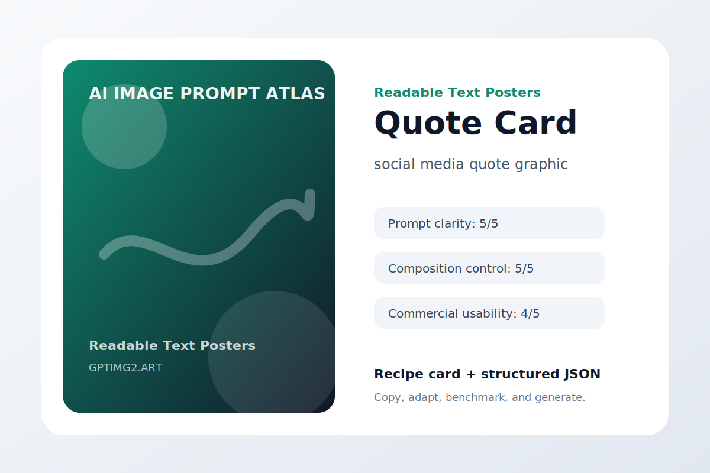
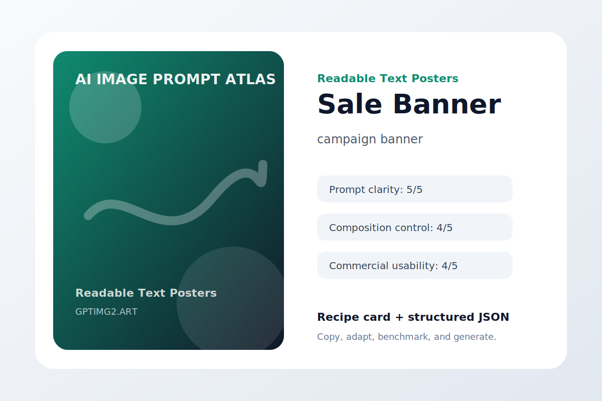
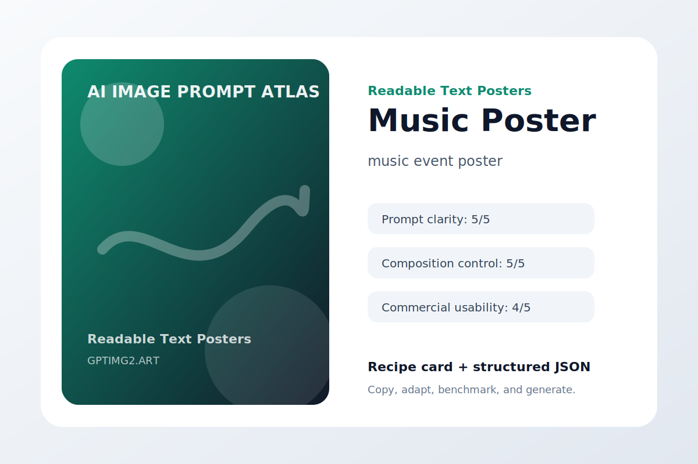
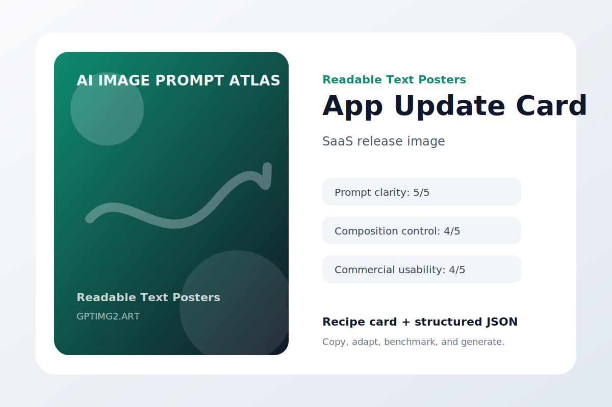

# Readable Text Posters

Poster and cover prompts that prioritize legible typography and clean layout.

## Launch Poster


**Use case:** startup announcement visual  
**Input type:** text prompt  
**Aspect ratio:** 4:5 or 9:16  
**Difficulty:** easy

**Prompt**

```text
Design a startup announcement visual where the message is the hero and the typography survives thumbnail size.

The central visual is a clean launch poster with the headline NEW CREATIVE TOOLS. Keep the exact words large and legible, avoid extra lettering, and make the layout feel intentionally designed rather than decorated.

Art direction: polished, practical, visually specific, and suitable for a public prompt library.

Avoid: warped geometry, random logos, accidental text, duplicated objects, messy backgrounds, watermark, and low-resolution artifacts.
```

**Negative instructions**

```text
watermark, unreadable text, random logos, warped hands or objects, duplicated subjects, messy background, low-resolution artifacts, extra words
```

**Why it works**

- It starts with the outcome the image needs to serve, so the model is not guessing the format.
- The subject is concrete enough to anchor the scene before style words enter the prompt.
- The art direction describes what success should feel like, not just what should appear.
- The avoid list removes the common visual failures that usually make AI images hard to use.

**Variations**

- Make a minimal startup announcement visual version with more whitespace.
- Make a bold social-media-ready version with stronger contrast.
- Make a premium editorial version with refined lighting and texture.

[Try this workflow on GPTImg2](https://gptimg2.art/)


---

## Workshop Flyer


**Use case:** event promotion poster  
**Input type:** text prompt  
**Aspect ratio:** 4:5 or 9:16  
**Difficulty:** medium

**Prompt**

```text
Design an event promotion poster where the message is the hero and the typography survives thumbnail size.

The central visual is a vertical workshop flyer with the headline PROMPT LAB. Keep the exact words large and legible, avoid extra lettering, and make the layout feel intentionally designed rather than decorated.

Art direction: polished, practical, visually specific, and suitable for a public prompt library.

Avoid: warped geometry, random logos, accidental text, duplicated objects, messy backgrounds, watermark, and low-resolution artifacts.
```

**Negative instructions**

```text
watermark, unreadable text, random logos, warped hands or objects, duplicated subjects, messy background, low-resolution artifacts, extra words
```

**Why it works**

- It starts with the outcome the image needs to serve, so the model is not guessing the format.
- The subject is concrete enough to anchor the scene before style words enter the prompt.
- The art direction describes what success should feel like, not just what should appear.
- The avoid list removes the common visual failures that usually make AI images hard to use.

**Variations**

- Make a minimal event promotion poster version with more whitespace.
- Make a bold social-media-ready version with stronger contrast.
- Make a premium editorial version with refined lighting and texture.

[Try this workflow on GPTImg2](https://gptimg2.art/)


---

## Quote Card



**Use case:** social media quote graphic  
**Input type:** text prompt  
**Aspect ratio:** 4:5 or 9:16  
**Difficulty:** advanced

**Prompt**

```text
Design a social media quote graphic where the message is the hero and the typography survives thumbnail size.

The central visual is an editorial quote card with the phrase MAKE THE IDEA VISIBLE. Keep the exact words large and legible, avoid extra lettering, and make the layout feel intentionally designed rather than decorated.

Art direction: polished, practical, visually specific, and suitable for a public prompt library.

Avoid: warped geometry, random logos, accidental text, duplicated objects, messy backgrounds, watermark, and low-resolution artifacts.
```

**Negative instructions**

```text
watermark, unreadable text, random logos, warped hands or objects, duplicated subjects, messy background, low-resolution artifacts, extra words
```

**Why it works**

- It starts with the outcome the image needs to serve, so the model is not guessing the format.
- The subject is concrete enough to anchor the scene before style words enter the prompt.
- The art direction describes what success should feel like, not just what should appear.
- The avoid list removes the common visual failures that usually make AI images hard to use.

**Variations**

- Make a minimal social media quote graphic version with more whitespace.
- Make a bold social-media-ready version with stronger contrast.
- Make a premium editorial version with refined lighting and texture.

[Try this workflow on GPTImg2](https://gptimg2.art/)


---

## Sale Banner



**Use case:** campaign banner  
**Input type:** text prompt  
**Aspect ratio:** 4:5 or 9:16  
**Difficulty:** easy

**Prompt**

```text
Design a campaign banner where the message is the hero and the typography survives thumbnail size.

The central visual is a modern ecommerce banner with the headline WINTER STUDIO SALE. Keep the exact words large and legible, avoid extra lettering, and make the layout feel intentionally designed rather than decorated.

Art direction: polished, practical, visually specific, and suitable for a public prompt library.

Avoid: warped geometry, random logos, accidental text, duplicated objects, messy backgrounds, watermark, and low-resolution artifacts.
```

**Negative instructions**

```text
watermark, unreadable text, random logos, warped hands or objects, duplicated subjects, messy background, low-resolution artifacts, extra words
```

**Why it works**

- It starts with the outcome the image needs to serve, so the model is not guessing the format.
- The subject is concrete enough to anchor the scene before style words enter the prompt.
- The art direction describes what success should feel like, not just what should appear.
- The avoid list removes the common visual failures that usually make AI images hard to use.

**Variations**

- Make a minimal campaign banner version with more whitespace.
- Make a bold social-media-ready version with stronger contrast.
- Make a premium editorial version with refined lighting and texture.

[Try this workflow on GPTImg2](https://gptimg2.art/)


---

## Music Poster



**Use case:** music event poster  
**Input type:** text prompt  
**Aspect ratio:** 4:5 or 9:16  
**Difficulty:** medium

**Prompt**

```text
Design a music event poster where the message is the hero and the typography survives thumbnail size.

The central visual is a minimal concert poster with the headline MIDNIGHT SYNTHS. Keep the exact words large and legible, avoid extra lettering, and make the layout feel intentionally designed rather than decorated.

Art direction: polished, practical, visually specific, and suitable for a public prompt library.

Avoid: warped geometry, random logos, accidental text, duplicated objects, messy backgrounds, watermark, and low-resolution artifacts.
```

**Negative instructions**

```text
watermark, unreadable text, random logos, warped hands or objects, duplicated subjects, messy background, low-resolution artifacts, extra words
```

**Why it works**

- It starts with the outcome the image needs to serve, so the model is not guessing the format.
- The subject is concrete enough to anchor the scene before style words enter the prompt.
- The art direction describes what success should feel like, not just what should appear.
- The avoid list removes the common visual failures that usually make AI images hard to use.

**Variations**

- Make a minimal music event poster version with more whitespace.
- Make a bold social-media-ready version with stronger contrast.
- Make a premium editorial version with refined lighting and texture.

[Try this workflow on GPTImg2](https://gptimg2.art/)


---

## App Update Card



**Use case:** SaaS release image  
**Input type:** text prompt  
**Aspect ratio:** 4:5 or 9:16  
**Difficulty:** advanced

**Prompt**

```text
Design a SaaS release image where the message is the hero and the typography survives thumbnail size.

The central visual is a product update card with the text VERSION 2.0. Keep the exact words large and legible, avoid extra lettering, and make the layout feel intentionally designed rather than decorated.

Art direction: polished, practical, visually specific, and suitable for a public prompt library.

Avoid: warped geometry, random logos, accidental text, duplicated objects, messy backgrounds, watermark, and low-resolution artifacts.
```

**Negative instructions**

```text
watermark, unreadable text, random logos, warped hands or objects, duplicated subjects, messy background, low-resolution artifacts, extra words
```

**Why it works**

- It starts with the outcome the image needs to serve, so the model is not guessing the format.
- The subject is concrete enough to anchor the scene before style words enter the prompt.
- The art direction describes what success should feel like, not just what should appear.
- The avoid list removes the common visual failures that usually make AI images hard to use.

**Variations**

- Make a minimal SaaS release image version with more whitespace.
- Make a bold social-media-ready version with stronger contrast.
- Make a premium editorial version with refined lighting and texture.

[Try this workflow on GPTImg2](https://gptimg2.art/)


---

## Coffee Menu


**Use case:** restaurant menu visual  
**Input type:** text prompt  
**Aspect ratio:** 4:5 or 9:16  
**Difficulty:** easy

**Prompt**

```text
Design a restaurant menu visual where the message is the hero and the typography survives thumbnail size.

The central visual is a small cafe menu board with clear prices and item names. Keep the exact words large and legible, avoid extra lettering, and make the layout feel intentionally designed rather than decorated.

Art direction: polished, practical, visually specific, and suitable for a public prompt library.

Avoid: warped geometry, random logos, accidental text, duplicated objects, messy backgrounds, watermark, and low-resolution artifacts.
```

**Negative instructions**

```text
watermark, unreadable text, random logos, warped hands or objects, duplicated subjects, messy background, low-resolution artifacts, extra words
```

**Why it works**

- It starts with the outcome the image needs to serve, so the model is not guessing the format.
- The subject is concrete enough to anchor the scene before style words enter the prompt.
- The art direction describes what success should feel like, not just what should appear.
- The avoid list removes the common visual failures that usually make AI images hard to use.

**Variations**

- Make a minimal restaurant menu visual version with more whitespace.
- Make a bold social-media-ready version with stronger contrast.
- Make a premium editorial version with refined lighting and texture.

[Try this workflow on GPTImg2](https://gptimg2.art/)


---

## Book Cover


**Use case:** publishing concept  
**Input type:** text prompt  
**Aspect ratio:** 4:5 or 9:16  
**Difficulty:** medium

**Prompt**

```text
Design a publishing concept where the message is the hero and the typography survives thumbnail size.

The central visual is a contemporary book cover with the title THE VISUAL BRIEF. Keep the exact words large and legible, avoid extra lettering, and make the layout feel intentionally designed rather than decorated.

Art direction: polished, practical, visually specific, and suitable for a public prompt library.

Avoid: warped geometry, random logos, accidental text, duplicated objects, messy backgrounds, watermark, and low-resolution artifacts.
```

**Negative instructions**

```text
watermark, unreadable text, random logos, warped hands or objects, duplicated subjects, messy background, low-resolution artifacts, extra words
```

**Why it works**

- It starts with the outcome the image needs to serve, so the model is not guessing the format.
- The subject is concrete enough to anchor the scene before style words enter the prompt.
- The art direction describes what success should feel like, not just what should appear.
- The avoid list removes the common visual failures that usually make AI images hard to use.

**Variations**

- Make a minimal publishing concept version with more whitespace.
- Make a bold social-media-ready version with stronger contrast.
- Make a premium editorial version with refined lighting and texture.

[Try this workflow on GPTImg2](https://gptimg2.art/)

