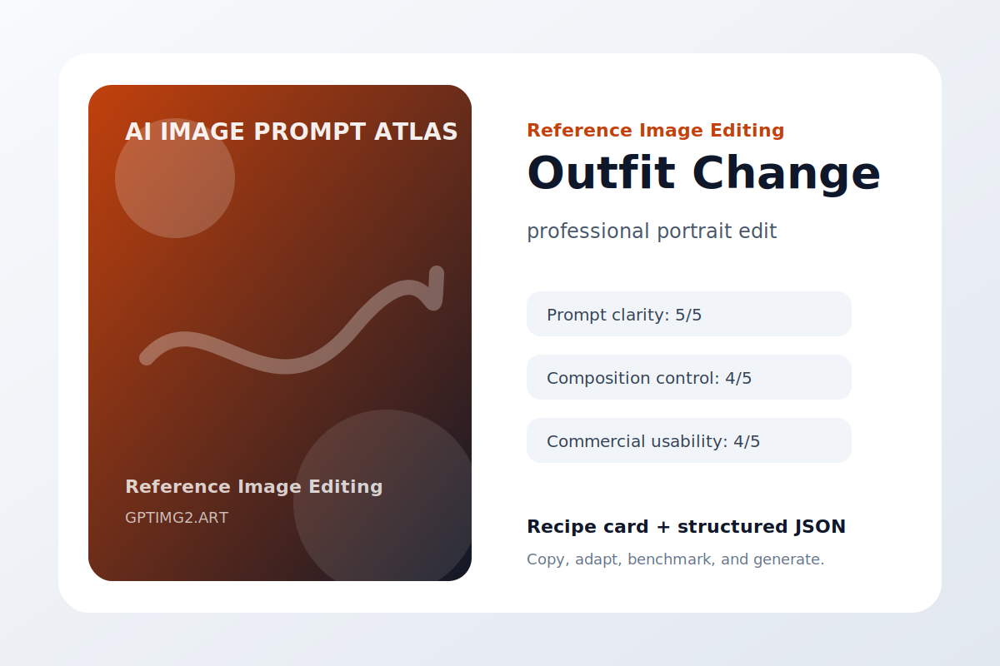
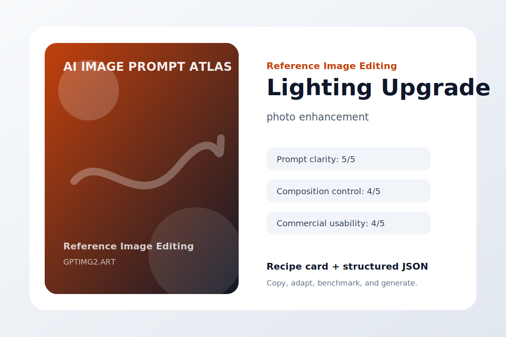

# Reference Image Editing

Editing prompts that preserve subject identity while changing context or style.

## Background Swap


**Use case:** portrait background edit  
**Input type:** reference image + text instruction  
**Aspect ratio:** 1:1 or 16:9  
**Difficulty:** easy

**Prompt**

```text
Edit the reference image for a portrait background edit while protecting the parts viewers would notice first.

The edit request is to replace a plain studio background with a sunlit modern apartment. Change only the requested attribute, preserve identity and geometry, and keep lighting, perspective, and edges physically plausible.

Art direction: polished, practical, visually specific, and suitable for a public prompt library.

Avoid: warped geometry, random logos, accidental text, duplicated objects, messy backgrounds, watermark, and low-resolution artifacts.
```

**Negative instructions**

```text
watermark, unreadable text, random logos, warped hands or objects, duplicated subjects, messy background, low-resolution artifacts, unwanted typography
```

**Why it works**

- It starts with the outcome the image needs to serve, so the model is not guessing the format.
- The subject is concrete enough to anchor the scene before style words enter the prompt.
- The art direction describes what success should feel like, not just what should appear.
- The avoid list removes the common visual failures that usually make AI images hard to use.

**Variations**

- Make a minimal portrait background edit version with more whitespace.
- Make a bold social-media-ready version with stronger contrast.
- Make a premium editorial version with refined lighting and texture.

[Try this workflow on GPTImg2](https://gptimg2.art/)


---

## Outfit Change



**Use case:** professional portrait edit  
**Input type:** reference image + text instruction  
**Aspect ratio:** 1:1 or 16:9  
**Difficulty:** medium

**Prompt**

```text
Edit the reference image for a professional portrait edit while protecting the parts viewers would notice first.

The edit request is to change the outfit to a navy blazer and white shirt while preserving face and pose. Change only the requested attribute, preserve identity and geometry, and keep lighting, perspective, and edges physically plausible.

Art direction: polished, practical, visually specific, and suitable for a public prompt library.

Avoid: warped geometry, random logos, accidental text, duplicated objects, messy backgrounds, watermark, and low-resolution artifacts.
```

**Negative instructions**

```text
watermark, unreadable text, random logos, warped hands or objects, duplicated subjects, messy background, low-resolution artifacts, unwanted typography
```

**Why it works**

- It starts with the outcome the image needs to serve, so the model is not guessing the format.
- The subject is concrete enough to anchor the scene before style words enter the prompt.
- The art direction describes what success should feel like, not just what should appear.
- The avoid list removes the common visual failures that usually make AI images hard to use.

**Variations**

- Make a minimal professional portrait edit version with more whitespace.
- Make a bold social-media-ready version with stronger contrast.
- Make a premium editorial version with refined lighting and texture.

[Try this workflow on GPTImg2](https://gptimg2.art/)


---

## Product Colorway


**Use case:** SKU color variation  
**Input type:** reference image + text instruction  
**Aspect ratio:** 1:1 or 16:9  
**Difficulty:** advanced

**Prompt**

```text
Edit the reference image for a SKU color variation while protecting the parts viewers would notice first.

The edit request is to turn the product shell from white to matte forest green. Change only the requested attribute, preserve identity and geometry, and keep lighting, perspective, and edges physically plausible.

Art direction: polished, practical, visually specific, and suitable for a public prompt library.

Avoid: warped geometry, random logos, accidental text, duplicated objects, messy backgrounds, watermark, and low-resolution artifacts.
```

**Negative instructions**

```text
watermark, unreadable text, random logos, warped hands or objects, duplicated subjects, messy background, low-resolution artifacts, unwanted typography
```

**Why it works**

- It starts with the outcome the image needs to serve, so the model is not guessing the format.
- The subject is concrete enough to anchor the scene before style words enter the prompt.
- The art direction describes what success should feel like, not just what should appear.
- The avoid list removes the common visual failures that usually make AI images hard to use.

**Variations**

- Make a minimal SKU color variation version with more whitespace.
- Make a bold social-media-ready version with stronger contrast.
- Make a premium editorial version with refined lighting and texture.

[Try this workflow on GPTImg2](https://gptimg2.art/)


---

## Lighting Upgrade



**Use case:** photo enhancement  
**Input type:** reference image + text instruction  
**Aspect ratio:** 1:1 or 16:9  
**Difficulty:** easy

**Prompt**

```text
Edit the reference image for a photo enhancement while protecting the parts viewers would notice first.

The edit request is to improve flat lighting into soft cinematic window light. Change only the requested attribute, preserve identity and geometry, and keep lighting, perspective, and edges physically plausible.

Art direction: polished, practical, visually specific, and suitable for a public prompt library.

Avoid: warped geometry, random logos, accidental text, duplicated objects, messy backgrounds, watermark, and low-resolution artifacts.
```

**Negative instructions**

```text
watermark, unreadable text, random logos, warped hands or objects, duplicated subjects, messy background, low-resolution artifacts, unwanted typography
```

**Why it works**

- It starts with the outcome the image needs to serve, so the model is not guessing the format.
- The subject is concrete enough to anchor the scene before style words enter the prompt.
- The art direction describes what success should feel like, not just what should appear.
- The avoid list removes the common visual failures that usually make AI images hard to use.

**Variations**

- Make a minimal photo enhancement version with more whitespace.
- Make a bold social-media-ready version with stronger contrast.
- Make a premium editorial version with refined lighting and texture.

[Try this workflow on GPTImg2](https://gptimg2.art/)


---

## Clean Object Removal


**Use case:** commercial cleanup  
**Input type:** reference image + text instruction  
**Aspect ratio:** 1:1 or 16:9  
**Difficulty:** medium

**Prompt**

```text
Edit the reference image for a commercial cleanup while protecting the parts viewers would notice first.

The edit request is to remove stray cables and desk clutter from a product photo. Change only the requested attribute, preserve identity and geometry, and keep lighting, perspective, and edges physically plausible.

Art direction: polished, practical, visually specific, and suitable for a public prompt library.

Avoid: warped geometry, random logos, accidental text, duplicated objects, messy backgrounds, watermark, and low-resolution artifacts.
```

**Negative instructions**

```text
watermark, unreadable text, random logos, warped hands or objects, duplicated subjects, messy background, low-resolution artifacts, unwanted typography
```

**Why it works**

- It starts with the outcome the image needs to serve, so the model is not guessing the format.
- The subject is concrete enough to anchor the scene before style words enter the prompt.
- The art direction describes what success should feel like, not just what should appear.
- The avoid list removes the common visual failures that usually make AI images hard to use.

**Variations**

- Make a minimal commercial cleanup version with more whitespace.
- Make a bold social-media-ready version with stronger contrast.
- Make a premium editorial version with refined lighting and texture.

[Try this workflow on GPTImg2](https://gptimg2.art/)


---

## Season Change


**Use case:** environment edit  
**Input type:** reference image + text instruction  
**Aspect ratio:** 1:1 or 16:9  
**Difficulty:** advanced

**Prompt**

```text
Edit the reference image for an environment edit while protecting the parts viewers would notice first.

The edit request is to change a summer street scene into early autumn while keeping architecture identical. Change only the requested attribute, preserve identity and geometry, and keep lighting, perspective, and edges physically plausible.

Art direction: polished, practical, visually specific, and suitable for a public prompt library.

Avoid: warped geometry, random logos, accidental text, duplicated objects, messy backgrounds, watermark, and low-resolution artifacts.
```

**Negative instructions**

```text
watermark, unreadable text, random logos, warped hands or objects, duplicated subjects, messy background, low-resolution artifacts, unwanted typography
```

**Why it works**

- It starts with the outcome the image needs to serve, so the model is not guessing the format.
- The subject is concrete enough to anchor the scene before style words enter the prompt.
- The art direction describes what success should feel like, not just what should appear.
- The avoid list removes the common visual failures that usually make AI images hard to use.

**Variations**

- Make a minimal environment edit version with more whitespace.
- Make a bold social-media-ready version with stronger contrast.
- Make a premium editorial version with refined lighting and texture.

[Try this workflow on GPTImg2](https://gptimg2.art/)


---

## Material Swap


**Use case:** interior design edit  
**Input type:** reference image + text instruction  
**Aspect ratio:** 1:1 or 16:9  
**Difficulty:** easy

**Prompt**

```text
Edit the reference image for an interior design edit while protecting the parts viewers would notice first.

The edit request is to change a plastic chair into walnut wood with the same shape. Change only the requested attribute, preserve identity and geometry, and keep lighting, perspective, and edges physically plausible.

Art direction: polished, practical, visually specific, and suitable for a public prompt library.

Avoid: warped geometry, random logos, accidental text, duplicated objects, messy backgrounds, watermark, and low-resolution artifacts.
```

**Negative instructions**

```text
watermark, unreadable text, random logos, warped hands or objects, duplicated subjects, messy background, low-resolution artifacts, unwanted typography
```

**Why it works**

- It starts with the outcome the image needs to serve, so the model is not guessing the format.
- The subject is concrete enough to anchor the scene before style words enter the prompt.
- The art direction describes what success should feel like, not just what should appear.
- The avoid list removes the common visual failures that usually make AI images hard to use.

**Variations**

- Make a minimal interior design edit version with more whitespace.
- Make a bold social-media-ready version with stronger contrast.
- Make a premium editorial version with refined lighting and texture.

[Try this workflow on GPTImg2](https://gptimg2.art/)


---

## Text Replacement


**Use case:** localized marketing asset  
**Input type:** reference image + text instruction  
**Aspect ratio:** 1:1 or 16:9  
**Difficulty:** medium

**Prompt**

```text
Edit the reference image for a localized marketing asset while protecting the parts viewers would notice first.

The edit request is to replace the poster headline while preserving layout and typography. Change only the requested attribute, preserve identity and geometry, and keep lighting, perspective, and edges physically plausible.

Art direction: polished, practical, visually specific, and suitable for a public prompt library.

Avoid: warped geometry, random logos, accidental text, duplicated objects, messy backgrounds, watermark, and low-resolution artifacts.
```

**Negative instructions**

```text
watermark, unreadable text, random logos, warped hands or objects, duplicated subjects, messy background, low-resolution artifacts, unwanted typography
```

**Why it works**

- It starts with the outcome the image needs to serve, so the model is not guessing the format.
- The subject is concrete enough to anchor the scene before style words enter the prompt.
- The art direction describes what success should feel like, not just what should appear.
- The avoid list removes the common visual failures that usually make AI images hard to use.

**Variations**

- Make a minimal localized marketing asset version with more whitespace.
- Make a bold social-media-ready version with stronger contrast.
- Make a premium editorial version with refined lighting and texture.

[Try this workflow on GPTImg2](https://gptimg2.art/)

