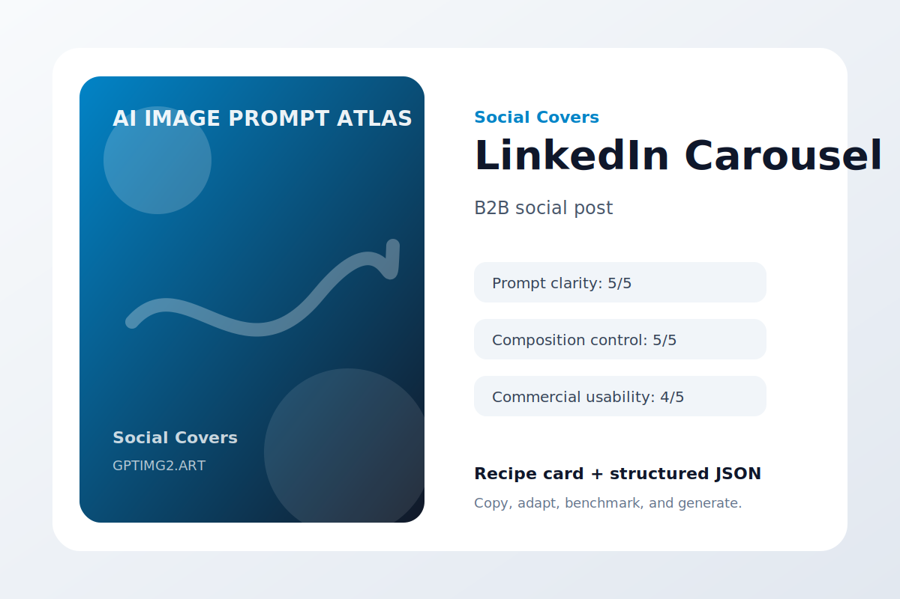
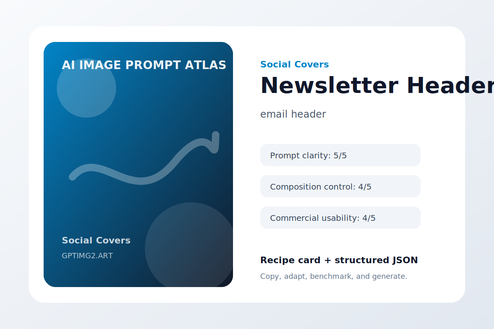
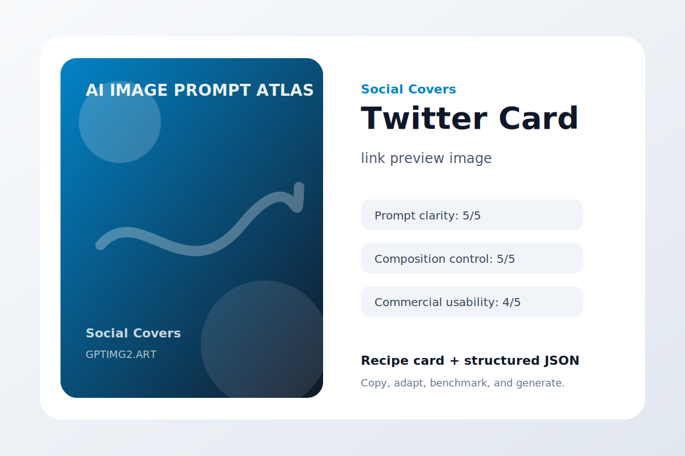
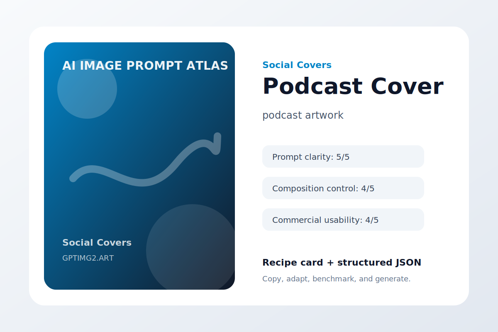
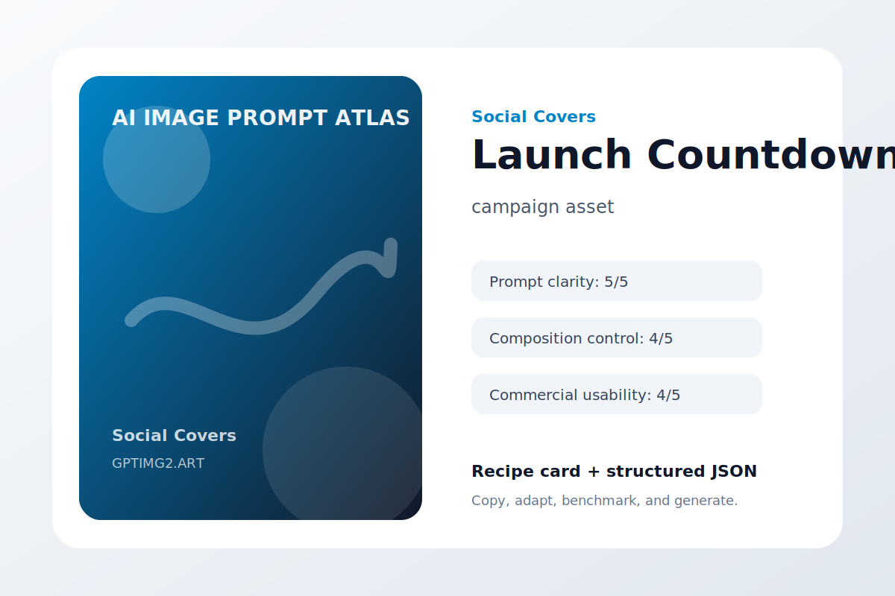

# Social Covers

Thumbnails, blog covers, carousels, and social posts.

## AI Prompt Guide Cover


**Use case:** article cover  
**Input type:** text prompt  
**Aspect ratio:** 16:9  
**Difficulty:** easy

**Prompt**

```text
Make an article cover with one idea, one focal point, and enough space for distribution crops.

The cover concept is a 16:9 blog cover about writing better AI image prompts. Use a bold focal point, editorial lighting, and a composition that works for both wide previews and cropped social feeds.

Art direction: polished, practical, visually specific, and suitable for a public prompt library.

Avoid: warped geometry, random logos, accidental text, duplicated objects, messy backgrounds, watermark, and low-resolution artifacts.
```

**Negative instructions**

```text
watermark, unreadable text, random logos, warped hands or objects, duplicated subjects, messy background, low-resolution artifacts, unwanted typography
```

**Why it works**

- It starts with the outcome the image needs to serve, so the model is not guessing the format.
- The subject is concrete enough to anchor the scene before style words enter the prompt.
- The art direction describes what success should feel like, not just what should appear.
- The avoid list removes the common visual failures that usually make AI images hard to use.

**Variations**

- Make a minimal article cover version with more whitespace.
- Make a bold social-media-ready version with stronger contrast.
- Make a premium editorial version with refined lighting and texture.

[Try this workflow on GPTImg2](https://gptimg2.art/)


---

## Creator Toolkit Thumbnail


**Use case:** video thumbnail  
**Input type:** text prompt  
**Aspect ratio:** 16:9  
**Difficulty:** medium

**Prompt**

```text
Make a video thumbnail with one idea, one focal point, and enough space for distribution crops.

The cover concept is a YouTube-style thumbnail for a creator tools roundup. Use a bold focal point, editorial lighting, and a composition that works for both wide previews and cropped social feeds.

Art direction: polished, practical, visually specific, and suitable for a public prompt library.

Avoid: warped geometry, random logos, accidental text, duplicated objects, messy backgrounds, watermark, and low-resolution artifacts.
```

**Negative instructions**

```text
watermark, unreadable text, random logos, warped hands or objects, duplicated subjects, messy background, low-resolution artifacts, unwanted typography
```

**Why it works**

- It starts with the outcome the image needs to serve, so the model is not guessing the format.
- The subject is concrete enough to anchor the scene before style words enter the prompt.
- The art direction describes what success should feel like, not just what should appear.
- The avoid list removes the common visual failures that usually make AI images hard to use.

**Variations**

- Make a minimal video thumbnail version with more whitespace.
- Make a bold social-media-ready version with stronger contrast.
- Make a premium editorial version with refined lighting and texture.

[Try this workflow on GPTImg2](https://gptimg2.art/)


---

## LinkedIn Carousel



**Use case:** B2B social post  
**Input type:** text prompt  
**Aspect ratio:** 16:9  
**Difficulty:** advanced

**Prompt**

```text
Make a B2B social post with one idea, one focal point, and enough space for distribution crops.

The cover concept is a professional carousel cover about product photography prompts. Use a bold focal point, editorial lighting, and a composition that works for both wide previews and cropped social feeds.

Art direction: polished, practical, visually specific, and suitable for a public prompt library.

Avoid: warped geometry, random logos, accidental text, duplicated objects, messy backgrounds, watermark, and low-resolution artifacts.
```

**Negative instructions**

```text
watermark, unreadable text, random logos, warped hands or objects, duplicated subjects, messy background, low-resolution artifacts, unwanted typography
```

**Why it works**

- It starts with the outcome the image needs to serve, so the model is not guessing the format.
- The subject is concrete enough to anchor the scene before style words enter the prompt.
- The art direction describes what success should feel like, not just what should appear.
- The avoid list removes the common visual failures that usually make AI images hard to use.

**Variations**

- Make a minimal B2B social post version with more whitespace.
- Make a bold social-media-ready version with stronger contrast.
- Make a premium editorial version with refined lighting and texture.

[Try this workflow on GPTImg2](https://gptimg2.art/)


---

## Newsletter Header



**Use case:** email header  
**Input type:** text prompt  
**Aspect ratio:** 16:9  
**Difficulty:** easy

**Prompt**

```text
Make an email header with one idea, one focal point, and enough space for distribution crops.

The cover concept is an editorial newsletter header for creative AI workflows. Use a bold focal point, editorial lighting, and a composition that works for both wide previews and cropped social feeds.

Art direction: polished, practical, visually specific, and suitable for a public prompt library.

Avoid: warped geometry, random logos, accidental text, duplicated objects, messy backgrounds, watermark, and low-resolution artifacts.
```

**Negative instructions**

```text
watermark, unreadable text, random logos, warped hands or objects, duplicated subjects, messy background, low-resolution artifacts, unwanted typography
```

**Why it works**

- It starts with the outcome the image needs to serve, so the model is not guessing the format.
- The subject is concrete enough to anchor the scene before style words enter the prompt.
- The art direction describes what success should feel like, not just what should appear.
- The avoid list removes the common visual failures that usually make AI images hard to use.

**Variations**

- Make a minimal email header version with more whitespace.
- Make a bold social-media-ready version with stronger contrast.
- Make a premium editorial version with refined lighting and texture.

[Try this workflow on GPTImg2](https://gptimg2.art/)


---

## Twitter Card



**Use case:** link preview image  
**Input type:** text prompt  
**Aspect ratio:** 16:9  
**Difficulty:** medium

**Prompt**

```text
Make a link preview image with one idea, one focal point, and enough space for distribution crops.

The cover concept is a compact card for a prompt template collection. Use a bold focal point, editorial lighting, and a composition that works for both wide previews and cropped social feeds.

Art direction: polished, practical, visually specific, and suitable for a public prompt library.

Avoid: warped geometry, random logos, accidental text, duplicated objects, messy backgrounds, watermark, and low-resolution artifacts.
```

**Negative instructions**

```text
watermark, unreadable text, random logos, warped hands or objects, duplicated subjects, messy background, low-resolution artifacts, unwanted typography
```

**Why it works**

- It starts with the outcome the image needs to serve, so the model is not guessing the format.
- The subject is concrete enough to anchor the scene before style words enter the prompt.
- The art direction describes what success should feel like, not just what should appear.
- The avoid list removes the common visual failures that usually make AI images hard to use.

**Variations**

- Make a minimal link preview image version with more whitespace.
- Make a bold social-media-ready version with stronger contrast.
- Make a premium editorial version with refined lighting and texture.

[Try this workflow on GPTImg2](https://gptimg2.art/)


---

## Podcast Cover



**Use case:** podcast artwork  
**Input type:** text prompt  
**Aspect ratio:** 16:9  
**Difficulty:** advanced

**Prompt**

```text
Make a podcast artwork with one idea, one focal point, and enough space for distribution crops.

The cover concept is a square podcast cover for a show about visual AI tools. Use a bold focal point, editorial lighting, and a composition that works for both wide previews and cropped social feeds.

Art direction: polished, practical, visually specific, and suitable for a public prompt library.

Avoid: warped geometry, random logos, accidental text, duplicated objects, messy backgrounds, watermark, and low-resolution artifacts.
```

**Negative instructions**

```text
watermark, unreadable text, random logos, warped hands or objects, duplicated subjects, messy background, low-resolution artifacts, unwanted typography
```

**Why it works**

- It starts with the outcome the image needs to serve, so the model is not guessing the format.
- The subject is concrete enough to anchor the scene before style words enter the prompt.
- The art direction describes what success should feel like, not just what should appear.
- The avoid list removes the common visual failures that usually make AI images hard to use.

**Variations**

- Make a minimal podcast artwork version with more whitespace.
- Make a bold social-media-ready version with stronger contrast.
- Make a premium editorial version with refined lighting and texture.

[Try this workflow on GPTImg2](https://gptimg2.art/)


---

## Case Study Header


**Use case:** case study cover  
**Input type:** text prompt  
**Aspect ratio:** 16:9  
**Difficulty:** easy

**Prompt**

```text
Make a case study cover with one idea, one focal point, and enough space for distribution crops.

The cover concept is a clean header for an ecommerce image generation case study. Use a bold focal point, editorial lighting, and a composition that works for both wide previews and cropped social feeds.

Art direction: polished, practical, visually specific, and suitable for a public prompt library.

Avoid: warped geometry, random logos, accidental text, duplicated objects, messy backgrounds, watermark, and low-resolution artifacts.
```

**Negative instructions**

```text
watermark, unreadable text, random logos, warped hands or objects, duplicated subjects, messy background, low-resolution artifacts, unwanted typography
```

**Why it works**

- It starts with the outcome the image needs to serve, so the model is not guessing the format.
- The subject is concrete enough to anchor the scene before style words enter the prompt.
- The art direction describes what success should feel like, not just what should appear.
- The avoid list removes the common visual failures that usually make AI images hard to use.

**Variations**

- Make a minimal case study cover version with more whitespace.
- Make a bold social-media-ready version with stronger contrast.
- Make a premium editorial version with refined lighting and texture.

[Try this workflow on GPTImg2](https://gptimg2.art/)


---

## Launch Countdown



**Use case:** campaign asset  
**Input type:** text prompt  
**Aspect ratio:** 16:9  
**Difficulty:** medium

**Prompt**

```text
Make a campaign asset with one idea, one focal point, and enough space for distribution crops.

The cover concept is a bold social countdown graphic reading 3 DAYS TO LAUNCH. Use a bold focal point, editorial lighting, and a composition that works for both wide previews and cropped social feeds.

Art direction: polished, practical, visually specific, and suitable for a public prompt library.

Avoid: warped geometry, random logos, accidental text, duplicated objects, messy backgrounds, watermark, and low-resolution artifacts.
```

**Negative instructions**

```text
watermark, unreadable text, random logos, warped hands or objects, duplicated subjects, messy background, low-resolution artifacts, unwanted typography
```

**Why it works**

- It starts with the outcome the image needs to serve, so the model is not guessing the format.
- The subject is concrete enough to anchor the scene before style words enter the prompt.
- The art direction describes what success should feel like, not just what should appear.
- The avoid list removes the common visual failures that usually make AI images hard to use.

**Variations**

- Make a minimal campaign asset version with more whitespace.
- Make a bold social-media-ready version with stronger contrast.
- Make a premium editorial version with refined lighting and texture.

[Try this workflow on GPTImg2](https://gptimg2.art/)

